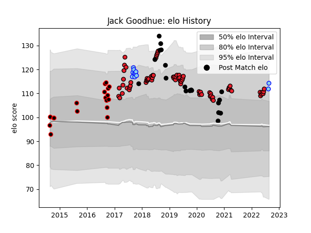

---  
layout: page  
title: Jack Goodhue  
date: 2023-02-24 09:52:45.954028  
categories: player  
---
# Jack Goodhue

## Positions: C

## Country: New Zealand

## Current elo: 114.0

## Current Percentile: 82.0

# Elo History

# Match History

| Team        |   Appearances |   Win Rate |
|:------------|--------------:|-----------:|
| Crusaders   |            71 |   0.84507  |
| New Zealand |            20 |   0.7      |
| Canterbury  |            18 |   0.833333 |
| Northland   |            11 |   0.454545 |

| Opponent                 |   Matches |   Win Rate |
|:-------------------------|----------:|-----------:|
| Highlanders              |        12 |   0.833333 |
| Hurricanes               |        12 |   0.75     |
| Chiefs                   |        11 |   0.818182 |
| Australia                |         7 |   0.785714 |
| Blues                    |         7 |   1        |
| Waikato                  |         4 |   0.75     |
| Queensland Reds          |         4 |   1        |
| Otago                    |         4 |   1        |
| New South Wales Waratahs |         4 |   0.5      |
| Argentina                |         3 |   0.666667 |
| Stormers                 |         3 |   0.833333 |
| Melbourne Rebels         |         3 |   1        |
| Lions                    |         3 |   1        |
| Wellington               |         3 |   0.333333 |
| Counties Manukau         |         3 |   0.666667 |
| Bulls                    |         3 |   1        |
| Hawke's Bay              |         2 |   1        |
| North Harbour            |         2 |   0.5      |
| Tasman                   |         2 |   0.5      |
| Taranaki                 |         2 |   1        |
| Brumbies                 |         2 |   1        |
| South Africa             |         2 |   0.25     |
| Sharks                   |         2 |   0.75     |
| France                   |         2 |   1        |
| Northland                |         2 |   1        |
| Manawatu                 |         2 |   0        |
| England                  |         2 |   0.5      |
| Auckland                 |         2 |   0.5      |
| Ireland                  |         2 |   0.5      |
| Cheetahs                 |         1 |   1        |
| Canada                   |         1 |   1        |
| Namibia                  |         1 |   1        |
| Southland                |         1 |   1        |
| Sunwolves                |         1 |   1        |
| Fijian Drua              |         1 |   1        |
| British and Irish Lions  |         1 |   0        |
| Jaguares                 |         1 |   1        |