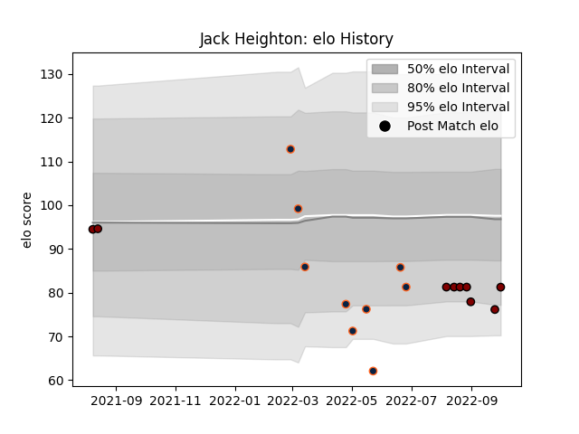

---  
layout: page  
title: Jack Heighton  
date: 2023-03-02 11:26:32.531064  
categories: player  
---
# Jack Heighton

## Positions: FH, FB

## Current elo: 81.0

## Current Percentile: 10.0

# Elo History

# Match History

| Team           |   Appearances |   Win Rate |
|:---------------|--------------:|-----------:|
| R.U. New York  |            11 |   0.636364 |
| North Harbour  |             9 |   0.555556 |
| Rugby New York |             9 |   0.666667 |

| Opponent               |   Matches |   Win Rate |
|:-----------------------|----------:|-----------:|
| New England Free Jacks |         5 |   0.2      |
| Seattle Seawolves      |         4 |   1        |
| Rugby ATL              |         3 |   0.333333 |
| San Diego Legion       |         2 |   1        |
| NOLA Gold              |         2 |   1        |
| Toronto Arrows         |         1 |   1        |
| Tasman                 |         1 |   1        |
| Taranaki               |         1 |   1        |
| Southland              |         1 |   1        |
| Auckland               |         1 |   0        |
| Canterbury             |         1 |   0        |
| Manawatu               |         1 |   1        |
| L. A. Giltinis         |         1 |   0        |
| Houston SaberCats      |         1 |   1        |
| Hawke's Bay            |         1 |   0        |
| Dallas Jackals         |         1 |   1        |
| Counties Manukau       |         1 |   1        |
| Waikato                |         1 |   0        |