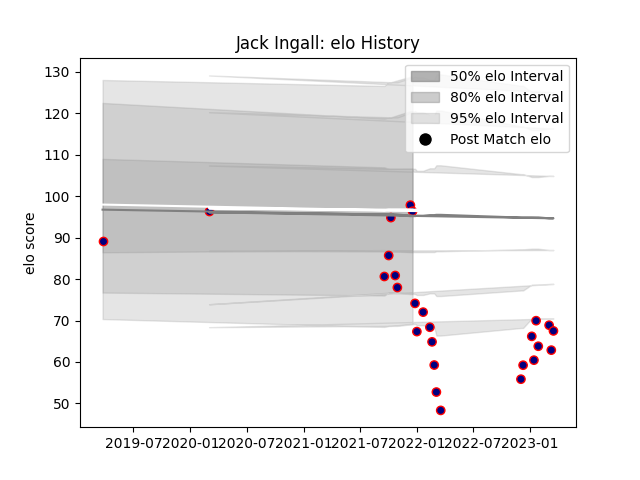

---  
layout: page  
title: Jack Ingall  
date: 2022-12-18 16:16:55.840782  
categories: player  
---
# Jack Ingall

## Positions: FL

## Current elo: 68.0

## Current Percentile: 0.0

# Elo History

# Match History

| Team            |   Appearances |   Win Rate |
|:----------------|--------------:|-----------:|
| London Scottish |            15 |        0.1 |

| Opponent            |   Matches |   Win Rate |
|:--------------------|----------:|-----------:|
| Ampthill            |         2 |       0    |
| Doncaster           |         2 |       0    |
| Ealing Trailfinders |         2 |       0    |
| Hartpury College    |         2 |       0.25 |
| Bedford             |         1 |       0    |
| Caldy               |         1 |       1    |
| Cornish Pirates     |         1 |       0    |
| Coventry            |         1 |       0    |
| Jersey              |         1 |       0    |
| Nottingham          |         1 |       0    |
| Yorkshire Carnegie  |         1 |       0    |