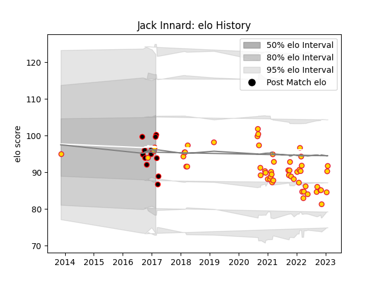

---  
layout: page  
title: Jack Innard  
date: 2023-02-02 18:41:55.230504  
categories: player  
---
# Jack Innard

## Positions: H

## Current elo: 100.0

## Current Percentile: 35.0

# Elo History

# Match History

| Team            |   Appearances |   Win Rate |
|:----------------|--------------:|-----------:|
| Exeter Chiefs   |            54 |   0.62963  |
| Cornish Pirates |            12 |   0.541667 |

| Opponent            |   Matches |   Win Rate |
|:--------------------|----------:|-----------:|
| Bath Rugby          |         6 |   1        |
| London Irish        |         6 |   0.333333 |
| Northampton Saints  |         6 |   0.5      |
| Worcester Warriors  |         5 |   0.8      |
| Wasps               |         5 |   0.2      |
| Leicester Tigers    |         5 |   0.6      |
| Newcastle Falcons   |         4 |   1        |
| Gloucester Rugby    |         3 |   0.666667 |
| Harlequins          |         3 |   0.666667 |
| Bristol Rugby       |         3 |   0.666667 |
| Saracens            |         3 |   0.333333 |
| Sale Sharks         |         3 |   0.666667 |
| Ealing Trailfinders |         2 |   0.75     |
| Rotherham Titans    |         2 |   0.5      |
| Yorkshire Carnegie  |         2 |   0.5      |
| Cardiff Blues       |         1 |   1        |
| Nottingham          |         1 |   1        |
| London Scottish     |         1 |   0        |
| Castres Olympique   |         1 |   1        |
| Bedford             |         1 |   1        |
| Bulls               |         1 |   0        |
| Jersey              |         1 |   0        |
| Doncaster           |         1 |   1        |