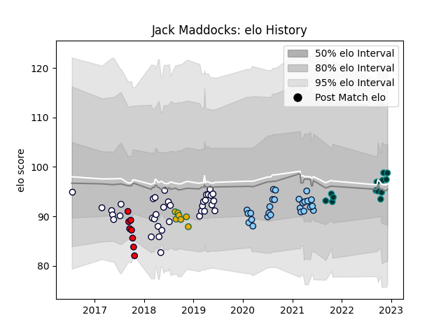

---  
layout: page  
title: Jack Maddocks  
date: 2023-02-02 18:57:51.042681  
categories: player  
---
# Jack Maddocks

## Positions: FB, W

## Country: Australia

## Current elo: 86.0

## Current Percentile: 23.0

# Elo History

# Match History

| Team                     |   Appearances |   Win Rate |
|:-------------------------|--------------:|-----------:|
| Melbourne Rebels         |            36 |   0.416667 |
| New South Wales Waratahs |            26 |   0.192308 |
| Pau                      |            17 |   0.323529 |
| Melbourne Rising         |             8 |   0.125    |
| Australia                |             7 |   0.142857 |

| Opponent                 |   Matches |   Win Rate |
|:-------------------------|----------:|-----------:|
| Queensland Reds          |        10 |   0.5      |
| Brumbies                 |         9 |   0.444444 |
| Western Force            |         5 |   0.4      |
| New South Wales Waratahs |         5 |   0        |
| Melbourne Rebels         |         5 |   0.2      |
| Blues                    |         4 |   0.25     |
| Sunwolves                |         4 |   1        |
| Crusaders                |         4 |   0        |
| Highlanders              |         3 |   0.333333 |
| Lions                    |         3 |   0.333333 |
| Hurricanes               |         3 |   0        |
| Stade Francais Paris     |         3 |   0.333333 |
| Lyon                     |         2 |   0        |
| Sharks                   |         2 |   0.5      |
| Jaguares                 |         2 |   0        |
| New Zealand              |         2 |   0        |
| South Africa             |         2 |   0.5      |
| Clermont Auvergne        |         2 |   0        |
| Castres Olympique        |         2 |   0        |
| Bulls                    |         2 |   0        |
| Bordeaux Begles          |         2 |   0.5      |
| Perth Spirit             |         1 |   0        |
| Sydney Rays              |         1 |   0        |
| Toulon                   |         1 |   0        |
| Wales                    |         1 |   0        |
| Queensland Country       |         1 |   0        |
| Stade Toulousain         |         1 |   1        |
| Argentina                |         1 |   0        |
| NSW Country Eagles       |         1 |   0        |
| Montpellier Herault      |         1 |   0        |
| Bayonne                  |         1 |   0.5      |
| Greater Sydney Rams      |         1 |   1        |
| Fijian Drua              |         1 |   0        |
| England                  |         1 |   0        |
| Chiefs                   |         1 |   0        |
| Canberra Vikings         |         1 |   0        |
| Brive                    |         1 |   1        |
| Brisbane City            |         1 |   0        |
| La Rochelle              |         1 |   1        |