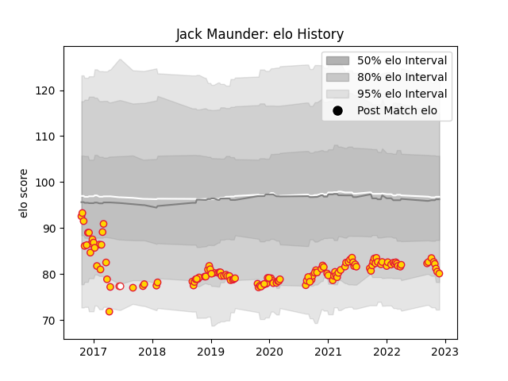

---  
layout: page  
title: Jack Maunder  
date: 2022-11-22 11:27:01.350863  
categories: player  
---
# Jack Maunder

## Positions: SH

## Country: England

## Current elo: 91.0

## Current Percentile: 36.0

# Elo History

# Match History

| Team          |   Appearances |   Win Rate |
|:--------------|--------------:|-----------:|
| Exeter Chiefs |           129 |   0.705426 |
| England       |             2 |   1        |

| Opponent           |   Matches |   Win Rate |
|:-------------------|----------:|-----------:|
| Sale Sharks        |        13 |   0.846154 |
| Worcester Warriors |        12 |   0.833333 |
| Bath Rugby         |        11 |   0.818182 |
| Northampton Saints |        11 |   0.636364 |
| Leicester Tigers   |        11 |   0.727273 |
| Gloucester Rugby   |        10 |   0.7      |
| Harlequins         |         9 |   0.444444 |
| Wasps              |         8 |   0.6875   |
| Saracens           |         8 |   0.5625   |
| Newcastle Falcons  |         8 |   0.875    |
| Bristol Rugby      |         7 |   0.857143 |
| London Irish       |         5 |   0.6      |
| Munster            |         2 |   0.25     |
| La Rochelle        |         2 |   1        |
| Glasgow Warriors   |         2 |   0.75     |
| Clermont Auvergne  |         2 |   0        |
| Castres Olympique  |         2 |   0.5      |
| Bordeaux Begles    |         2 |   0.5      |
| Argentina          |         2 |   1        |
| Racing 92          |         1 |   1        |
| Scarlets           |         1 |   1        |
| Stade Toulousain   |         1 |   1        |
| Ulster             |         1 |   0        |