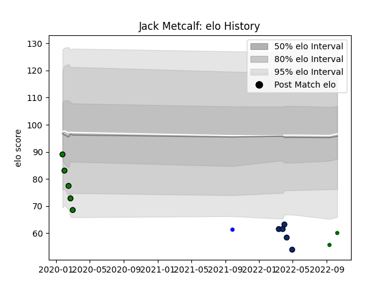

---  
layout: page  
title: Jack Metcalf  
date: 2023-02-02 19:01:39.914382  
categories: player  
---
# Jack Metcalf

## Positions: FB, C

## Current elo: 69.0

## Current Percentile: 4.0

# Elo History

# Match History

| Team                |   Appearances |   Win Rate |
|:--------------------|--------------:|-----------:|
| Yorkshire Carnegie  |             5 |      0     |
| Doncaster           |             4 |      0.5   |
| Sale Sharks         |             4 |      0.625 |
| Ealing Trailfinders |             2 |      1     |
| Coventry            |             1 |      0     |

| Opponent          |   Matches |   Win Rate |
|:------------------|----------:|-----------:|
| Ampthill          |         2 |        0   |
| Nottingham        |         2 |        0.5 |
| Richmond          |         2 |        1   |
| Bath Rugby        |         1 |        0.5 |
| Cornish Pirates   |         1 |        0   |
| Coventry          |         1 |        0   |
| Doncaster         |         1 |        1   |
| Gloucester Rugby  |         1 |        1   |
| Hartpury College  |         1 |        0   |
| Jersey            |         1 |        0   |
| London Scottish   |         1 |        0   |
| Newcastle Falcons |         1 |        1   |
| Saracens          |         1 |        0   |