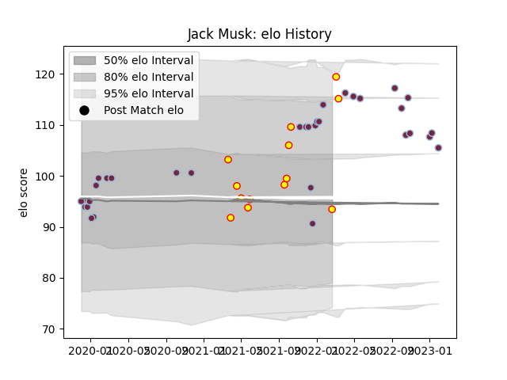

---  
layout: page  
title: Jack Musk  
date: 2023-02-02 18:58:04.629404  
categories: player  
---
# Jack Musk

## Positions: H

## Current elo: 93.0

## Current Percentile: 88.0

# Elo History

# Match History

| Team       |   Appearances |   Win Rate |
|:-----------|--------------:|-----------:|
| Harlequins |            33 |   0.560606 |
| Richmond   |            13 |   0.384615 |

| Opponent            |   Matches |   Win Rate |
|:--------------------|----------:|-----------:|
| Northampton Saints  |         4 |   0.5      |
| London Irish        |         4 |   0.5      |
| Leicester Tigers    |         4 |   0.375    |
| Gloucester Rugby    |         3 |   1        |
| Sale Sharks         |         3 |   0.333333 |
| Ampthill            |         2 |   0        |
| Ulster              |         2 |   0        |
| Saracens            |         2 |   0.5      |
| Nottingham          |         2 |   1        |
| Bath Rugby          |         2 |   0.5      |
| Wasps               |         2 |   1        |
| Exeter Chiefs       |         2 |   0.5      |
| Coventry            |         2 |   0        |
| Castres Olympique   |         2 |   1        |
| Ealing Trailfinders |         1 |   0        |
| Jersey              |         1 |   1        |
| Cornish Pirates     |         1 |   0        |
| London Scottish     |         1 |   1        |
| Newcastle Falcons   |         1 |   1        |
| Clermont Auvergne   |         1 |   0        |
| Cardiff Blues       |         1 |   1        |
| Bristol Rugby       |         1 |   0        |
| Bedford             |         1 |   0        |
| Hartpury College    |         1 |   1        |