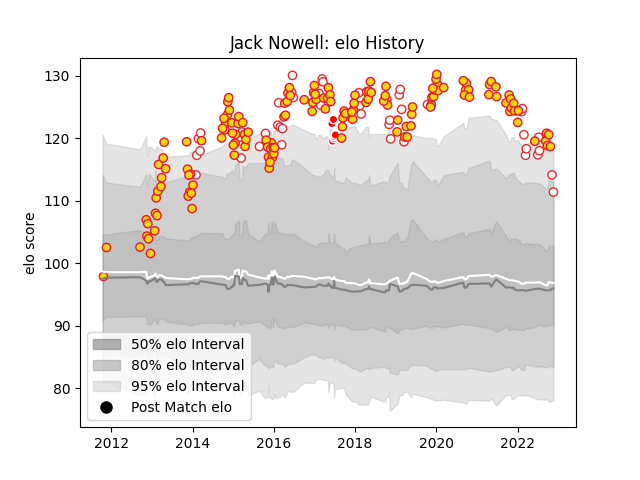

---  
layout: page  
title: Jack Nowell  
date: 2023-03-17 17:36:58.342579  
categories: player  
---
# Jack Nowell

## Positions: W

## Country: England

## Current elo: 80.0

## Current Percentile: 12.0

# Elo History

# Match History

| Team                    |   Appearances |   Win Rate |
|:------------------------|--------------:|-----------:|
| Exeter Chiefs           |           163 |   0.690184 |
| England                 |            45 |   0.688889 |
| British and Irish Lions |             6 |   0.5      |

| Opponent            |   Matches |   Win Rate |
|:--------------------|----------:|-----------:|
| Wasps               |        16 |   0.75     |
| Harlequins          |        13 |   0.692308 |
| Bath Rugby          |        12 |   0.666667 |
| Saracens            |        12 |   0.375    |
| Gloucester Rugby    |        12 |   0.666667 |
| Sale Sharks         |        11 |   0.818182 |
| Northampton Saints  |        11 |   0.818182 |
| Leicester Tigers    |         9 |   0.555556 |
| London Irish        |         9 |   0.777778 |
| France              |         7 |   0.571429 |
| Scotland            |         7 |   0.642857 |
| Worcester Warriors  |         7 |   1        |
| Newcastle Falcons   |         6 |   0.833333 |
| Ireland             |         6 |   0.5      |
| Australia           |         6 |   0.833333 |
| Wales               |         6 |   0.833333 |
| Bristol Rugby       |         5 |   0.8      |
| Italy               |         5 |   1        |
| Glasgow Warriors    |         4 |   0.625    |
| Castres Olympique   |         4 |   0.75     |
| New Zealand         |         4 |   0.5      |
| Bordeaux Begles     |         3 |   0.666667 |
| Ospreys             |         3 |   0.666667 |
| London Welsh        |         3 |   0.666667 |
| South Africa        |         2 |   0.5      |
| Toulon              |         2 |   0        |
| Clermont Auvergne   |         2 |   0.5      |
| Bayonne             |         2 |   0.5      |
| Bulls               |         2 |   0.5      |
| Connacht            |         2 |   1        |
| Munster             |         2 |   0.25     |
| Montpellier Herault |         2 |   0.5      |
| Leinster            |         2 |   0        |
| La Rochelle         |         2 |   1        |
| Argentina           |         2 |   0.5      |
| Racing 92           |         1 |   1        |
| Japan               |         1 |   1        |
| Scarlets            |         1 |   1        |
| Blues               |         1 |   0        |
| Hurricanes          |         1 |   0.5      |
| Stade Toulousain    |         1 |   1        |
| Highlanders         |         1 |   0        |
| Ulster              |         1 |   1        |
| Uruguay             |         1 |   1        |
| Cavalieri Prato     |         1 |   1        |
| Chiefs              |         1 |   1        |