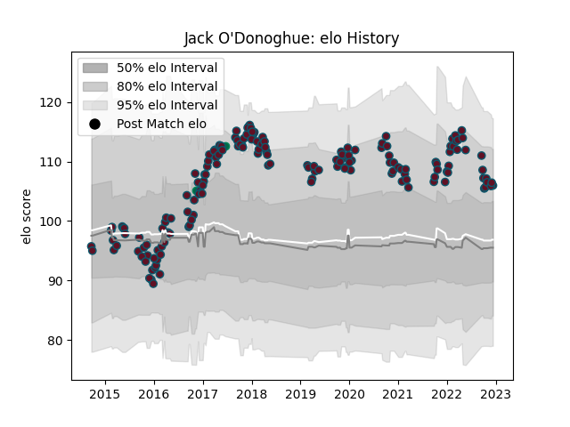

---  
layout: page  
title: Jack O'Donoghue  
date: 2022-12-18 16:16:17.836957  
categories: player  
---
# Jack O'Donoghue

## Positions: FL, N8

## Country: Ireland

## Current elo: 108.0

## Current Percentile: 82.0

# Elo History

# Match History

| Team    |   Appearances |   Win Rate |
|:--------|--------------:|-----------:|
| Munster |           164 |   0.679878 |
| Ireland |             2 |   1        |

| Opponent             |   Matches |   Win Rate |
|:---------------------|----------:|-----------:|
| Ospreys              |        15 |  0.733333  |
| Connacht             |        14 |  0.642857  |
| Ulster               |        13 |  0.615385  |
| Leinster             |        13 |  0.0769231 |
| Edinburgh            |        12 |  0.833333  |
| Glasgow Warriors     |        12 |  0.666667  |
| Benetton Treviso     |        11 |  1         |
| Zebre                |        10 |  1         |
| Cardiff Blues        |        10 |  0.6       |
| Dragons              |         9 |  0.888889  |
| Scarlets             |         8 |  0.6875    |
| Racing 92            |         7 |  0.5       |
| Leicester Tigers     |         6 |  0.5       |
| Castres Olympique    |         4 |  0.875     |
| Saracens             |         3 |  0.333333  |
| Southern Kings       |         3 |  1         |
| Bulls                |         2 |  0.5       |
| Cheetahs             |         2 |  1         |
| Stade Francais Paris |         2 |  0.5       |
| Stade Toulousain     |         2 |  0.5       |
| Toulon               |         1 |  1         |
| Wasps                |         1 |  1         |
| Canada               |         1 |  1         |
| Sharks               |         1 |  1         |
| Stormers             |         1 |  1         |
| Japan                |         1 |  1         |
| Lions                |         1 |  0         |
| Northampton Saints   |         1 |  1         |