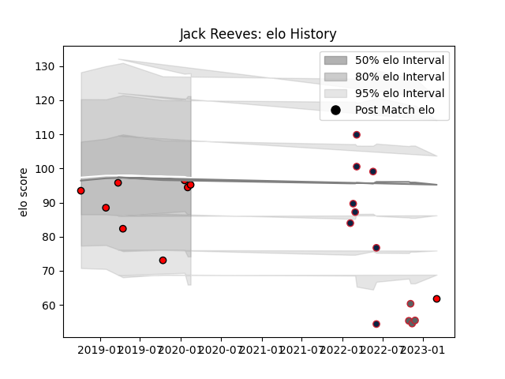

---  
layout: page  
title: Jack Reeves  
date: 2022-11-16 11:32:02.212130  
categories: player  
---
# Jack Reeves

## Positions: C, W

## Current elo: 81.0

## Current Percentile: 14.0

# Elo History

# Match History

| Team                   |   Appearances |   Win Rate |
|:-----------------------|--------------:|-----------:|
| New England Free Jacks |            10 |   0.8      |
| Gloucester Rugby       |             6 |   0.666667 |
| Hartpury College       |             4 |   0        |

| Opponent            |   Matches |   Win Rate |
|:--------------------|----------:|-----------:|
| NOLA Gold           |         3 |        1   |
| London Irish        |         2 |        0.5 |
| R.U. New York       |         2 |        0.5 |
| Rugby ATL           |         2 |        1   |
| Bath Rugby          |         1 |        1   |
| Bristol Rugby       |         1 |        1   |
| Cornish Pirates     |         1 |        0   |
| Doncaster           |         1 |        0   |
| Ealing Trailfinders |         1 |        0   |
| Exeter Chiefs       |         1 |        1   |
| Newcastle Falcons   |         1 |        0   |
| Old Glory DC        |         1 |        1   |
| Sale Sharks         |         1 |        0   |
| Seattle Seawolves   |         1 |        1   |
| Toronto Arrows      |         1 |        0   |