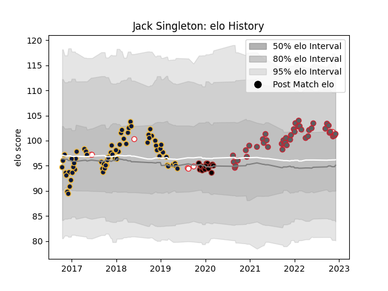

---  
layout: page  
title: Jack Singleton  
date: 2022-11-16 11:36:21.699202  
categories: player  
---
# Jack Singleton

## Positions: H

## Country: England

## Current elo: 100.0

## Current Percentile: 72.0

# Elo History

# Match History

| Team               |   Appearances |   Win Rate |
|:-------------------|--------------:|-----------:|
| Worcester Warriors |            66 |   0.416667 |
| Gloucester Rugby   |            41 |   0.573171 |
| Saracens           |            15 |   0.666667 |
| England            |             7 |   0.571429 |

| Opponent                 |   Matches |   Win Rate |
|:-------------------------|----------:|-----------:|
| Bath Rugby               |        10 |   0.6      |
| Harlequins               |        10 |   0.3      |
| Bristol Rugby            |         9 |   0.555556 |
| Wasps                    |         9 |   0.333333 |
| Exeter Chiefs            |         9 |   0.222222 |
| Leicester Tigers         |         9 |   0.555556 |
| Newcastle Falcons        |         9 |   0.444444 |
| Northampton Saints       |         8 |   0.375    |
| Saracens                 |         8 |   0.5      |
| Sale Sharks              |         6 |   0.5      |
| Gloucester Rugby         |         6 |   0.5      |
| London Irish             |         6 |   0.916667 |
| Worcester Warriors       |         4 |   1        |
| Brive                    |         4 |   0.25     |
| Ospreys                  |         3 |   1        |
| Argentina                |         3 |   0.666667 |
| RC Enisei                |         2 |   0.5      |
| Racing 92                |         2 |   0.5      |
| Dragons                  |         2 |   0.5      |
| Connacht                 |         2 |   0.25     |
| Wales                    |         2 |   0.5      |
| Barbarians               |         1 |   0        |
| Pau                      |         1 |   1        |
| Stade Francais Paris     |         1 |   1        |
| United States of America |         1 |   1        |
| Cardiff Blues            |         1 |   1        |
| Munster                  |         1 |   0        |