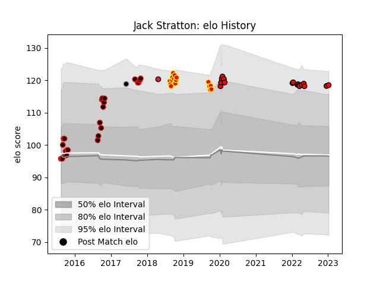

---  
layout: page  
title: Jack Stratton  
date: 2023-03-17 17:39:49.900966  
categories: player  
---
# Jack Stratton

## Positions: SH, FH

## Country: Provincial Union XV

## Current elo: 114.0

## Current Percentile: 88.0

# Elo History

# Match History

| Team                      |   Appearances |   Win Rate |
|:--------------------------|--------------:|-----------:|
| Canterbury                |            27 |   0.888889 |
| Toshiba Brave Lupus Tokyo |            24 |   0.541667 |
| Waikato                   |            16 |   0.5      |
| Crusaders                 |             1 |   1        |
| Provincial Union XV       |             1 |   0        |

| Opponent                          |   Matches |   Win Rate |
|:----------------------------------|----------:|-----------:|
| Taranaki                          |         6 |   0.666667 |
| Auckland                          |         5 |   0.8      |
| Hawke's Bay                       |         5 |   0.8      |
| Tasman                            |         5 |   0.8      |
| Otago                             |         5 |   0.6      |
| Tokyo Sungoliath                  |         4 |   0.5      |
| North Harbour                     |         4 |   0.75     |
| Kubota Spears Funabashi Tokyo-Bay |         3 |   0        |
| Counties Manukau                  |         3 |   0.666667 |
| Manawatu                          |         2 |   0.5      |
| Mie Honda Heat                    |         2 |   1        |
| Mitsubishi Dynaboars              |         2 |   1        |
| NTT Docomo Red Hurricanes Osaka   |         2 |   1        |
| Waikato                           |         2 |   1        |
| Northland                         |         2 |   1        |
| Urayasu D-Rocks                   |         2 |   0        |
| Saitama Wild Knights              |         2 |   0        |
| Southland                         |         2 |   1        |
| Kobelco Kobe Steelers             |         1 |   0        |
| Black Rams Tokyo                  |         1 |   0        |
| Wellington                        |         1 |   0        |
| Toyota Verblitz                   |         1 |   1        |
| Shizuoka Blue Revs                |         1 |   1        |
| British and Irish Lions           |         1 |   0        |
| Sunwolves                         |         1 |   1        |
| Green Rockets Tokatsu             |         1 |   1        |
| Bay of Plenty                     |         1 |   1        |
| Munakata Sanix Blues              |         1 |   1        |
| Yokohama Canon Eagles             |         1 |   1        |