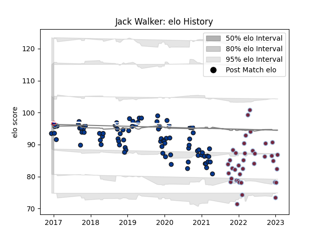

---  
layout: page  
title: Jack Walker  
date: 2023-02-02 19:14:28.742616  
categories: player  
---
# Jack Walker

## Positions: H

## Current elo: 97.0

## Current Percentile: None

# Elo History

# Match History

| Team            |   Appearances |   Win Rate |
|:----------------|--------------:|-----------:|
| Bath Rugby      |            84 |   0.458333 |
| Harlequins      |            38 |   0.552632 |
| London Scottish |             1 |   1        |

| Opponent           |   Matches |   Win Rate |
|:-------------------|----------:|-----------:|
| Exeter Chiefs      |        11 |   0.181818 |
| Gloucester Rugby   |        11 |   0.636364 |
| Leicester Tigers   |        10 |   0.7      |
| Newcastle Falcons  |         9 |   0.444444 |
| Saracens           |         9 |   0.166667 |
| Northampton Saints |         9 |   0.555556 |
| Wasps              |         8 |   0.5625   |
| Bristol Rugby      |         8 |   0.375    |
| Worcester Warriors |         8 |   1        |
| London Irish       |         7 |   0.714286 |
| Sale Sharks        |         7 |   0.357143 |
| Harlequins         |         6 |   0.5      |
| Cardiff Blues      |         3 |   0.666667 |
| Bath Rugby         |         3 |   0.666667 |
| Leinster           |         2 |   0        |
| Clermont Auvergne  |         2 |   0        |
| Sharks             |         2 |   0.5      |
| Stade Toulousain   |         2 |   0        |
| Ulster             |         2 |   0        |
| Racing 92          |         1 |   0        |
| Rotherham Titans   |         1 |   1        |
| Castres Olympique  |         1 |   1        |
| Scarlets           |         1 |   1        |