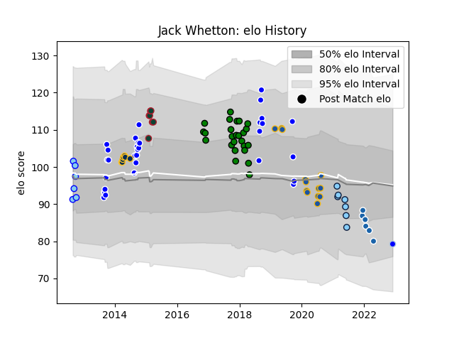

---  
layout: page  
title: Jack Whetton  
date: 2022-12-09 13:15:29.995137  
categories: player  
---
# Jack Whetton

## Positions: L

## Current elo: 79.0

## Current Percentile: 8.0

# Elo History

# Match History

| Team                     |   Appearances |   Win Rate |
|:-------------------------|--------------:|-----------:|
| Auckland                 |            32 |   0.640625 |
| Yorkshire Carnegie       |            25 |   0.64     |
| Highlanders              |            13 |   0.384615 |
| Brumbies                 |             7 |   0.571429 |
| Leicester Tigers         |             7 |   0.857143 |
| New South Wales Waratahs |             7 |   0        |
| Northland                |             5 |   0.2      |
| Castres Olympique        |             4 |   0        |
| Colomiers                |             1 |   0        |

| Opponent                 |   Matches |   Win Rate |
|:-------------------------|----------:|-----------:|
| Taranaki                 |         5 |   0.4      |
| Crusaders                |         5 |   0        |
| Canterbury               |         5 |   0.4      |
| Counties Manukau         |         4 |   0.75     |
| Chiefs                   |         3 |   0.666667 |
| Tasman                   |         3 |   0.5      |
| Richmond                 |         3 |   0.666667 |
| Doncaster                |         3 |   1        |
| Northland                |         3 |   1        |
| Queensland Reds          |         3 |   0.666667 |
| Waikato                  |         3 |   0.666667 |
| Wellington               |         3 |   0.333333 |
| Otago                    |         3 |   0        |
| Blues                    |         3 |   0.333333 |
| Bedford                  |         3 |   0.666667 |
| Bay of Plenty            |         2 |   1        |
| Nottingham               |         2 |   1        |
| North Harbour            |         2 |   1        |
| Rotherham Titans         |         2 |   0.5      |
| Melbourne Rebels         |         2 |   0        |
| Manawatu                 |         2 |   1        |
| Southland                |         2 |   0.5      |
| London Irish             |         2 |   0.5      |
| Hartpury College         |         2 |   0.75     |
| Jersey                   |         2 |   1        |
| Hurricanes               |         2 |   0.5      |
| Harlequins               |         2 |   0        |
| Exeter Chiefs            |         2 |   0.5      |
| Ealing Trailfinders      |         2 |   0.25     |
| Cornish Pirates          |         2 |   0.5      |
| Brumbies                 |         2 |   0.5      |
| Bristol Rugby            |         2 |   0        |
| Stormers                 |         1 |   1        |
| Racing 92                |         1 |   0        |
| Sale Sharks              |         1 |   1        |
| Aurillac                 |         1 |   0        |
| Lions                    |         1 |   0        |
| Northampton Saints       |         1 |   1        |
| New South Wales Waratahs |         1 |   0        |
| Munster                  |         1 |   0        |
| London Scottish          |         1 |   1        |
| Jaguares                 |         1 |   1        |
| Highlanders              |         1 |   0        |
| Gloucester Rugby         |         1 |   1        |
| Cardiff Blues            |         1 |   1        |
| Bulls                    |         1 |   0        |
| Western Force            |         1 |   0        |