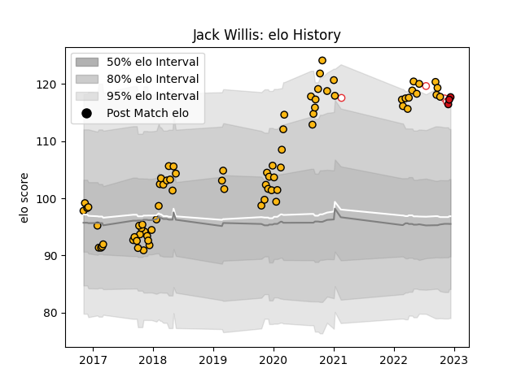

---  
layout: page  
title: Jack Willis  
date: 2023-03-16 20:11:27.633883  
categories: player  
---
# Jack Willis

## Positions: FL

## Country: England

## Current elo: 116.0

## Current Percentile: 93.0

# Elo History

# Match History

| Team             |   Appearances |   Win Rate |
|:-----------------|--------------:|-----------:|
| Wasps            |            80 |   0.54375  |
| Stade Toulousain |             9 |   0.888889 |
| England          |             7 |   0.642857 |

| Opponent            |   Matches |   Win Rate |
|:--------------------|----------:|-----------:|
| Sale Sharks         |        11 |   0.363636 |
| Leicester Tigers    |         7 |   0.428571 |
| Bristol Rugby       |         6 |   0.666667 |
| Northampton Saints  |         6 |   0.5      |
| Exeter Chiefs       |         6 |   0.333333 |
| Worcester Warriors  |         6 |   1        |
| London Irish        |         5 |   0.7      |
| Gloucester Rugby    |         5 |   0.8      |
| Harlequins          |         5 |   0.6      |
| Bath Rugby          |         5 |   0.8      |
| Newcastle Falcons   |         4 |   0.5      |
| Saracens            |         3 |   0.333333 |
| Ospreys             |         2 |   0.5      |
| Munster             |         2 |   1        |
| Lyon                |         2 |   0        |
| Bordeaux Begles     |         2 |   0        |
| Ulster              |         2 |   0.5      |
| Edinburgh           |         2 |   0.5      |
| Italy               |         2 |   1        |
| Racing 92           |         1 |   1        |
| Australia           |         1 |   1        |
| Perpignan           |         1 |   1        |
| Wales               |         1 |   1        |
| Montpellier Herault |         1 |   1        |
| New Zealand         |         1 |   0.5      |
| Biarritz Olympique  |         1 |   1        |
| Argentina           |         1 |   0        |
| La Rochelle         |         1 |   0        |
| France              |         1 |   0        |
| Bayonne             |         1 |   1        |
| Dragons             |         1 |   1        |
| Agen                |         1 |   1        |