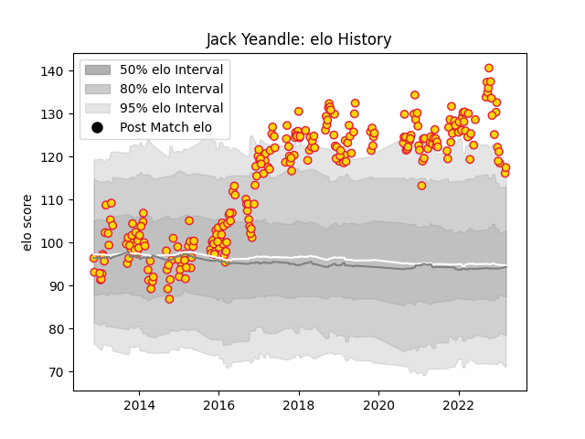

---  
layout: page  
title: Jack Yeandle  
date: 2023-03-17 17:23:21.675825  
categories: player  
---
# Jack Yeandle

## Positions: H

## Current elo: 117.0

## Current Percentile: 95.0

# Elo History

# Match History

| Team          |   Appearances |   Win Rate |
|:--------------|--------------:|-----------:|
| Exeter Chiefs |           255 |   0.639216 |

| Opponent            |   Matches |   Win Rate |
|:--------------------|----------:|-----------:|
| Gloucester Rugby    |        22 |   0.568182 |
| Bath Rugby          |        20 |   0.65     |
| Sale Sharks         |        20 |   0.7      |
| Northampton Saints  |        20 |   0.6      |
| Newcastle Falcons   |        20 |   0.8      |
| Harlequins          |        20 |   0.7      |
| Wasps               |        18 |   0.583333 |
| Leicester Tigers    |        18 |   0.5      |
| Saracens            |        17 |   0.323529 |
| Worcester Warriors  |        14 |   1        |
| London Irish        |        12 |   0.75     |
| Bristol Rugby       |        11 |   0.727273 |
| Clermont Auvergne   |         5 |   0.2      |
| London Welsh        |         4 |   1        |
| Munster             |         4 |   0.375    |
| Glasgow Warriors    |         4 |   0.75     |
| Leinster            |         3 |   0        |
| Castres Olympique   |         3 |   0.666667 |
| Ospreys             |         3 |   0.666667 |
| Montpellier Herault |         2 |   1        |
| Bulls               |         2 |   0.5      |
| Toulon              |         2 |   0        |
| Ulster              |         2 |   0.5      |
| Bordeaux Begles     |         2 |   0.5      |
| Cardiff Blues       |         2 |   1        |
| Bayonne             |         1 |   1        |
| Connacht            |         1 |   1        |
| Racing 92           |         1 |   1        |
| La Rochelle         |         1 |   1        |
| Stade Toulousain    |         1 |   1        |