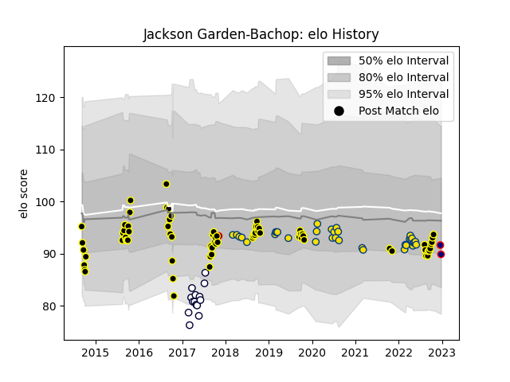

---  
layout: page  
title: Jackson Garden-Bachop  
date: 2023-03-17 17:33:37.889047  
categories: player  
---
# Jackson Garden-Bachop

## Positions: FH

## Country: New Zealand Maori

## Current elo: 107.0

## Current Percentile: 71.0

# Elo History

# Match History

| Team              |   Appearances |   Win Rate |
|:------------------|--------------:|-----------:|
| Wellington        |            73 |   0.636986 |
| Hurricanes        |            34 |   0.602941 |
| Melbourne Rebels  |            14 |   0.107143 |
| New Zealand Maori |             1 |   1        |

| Opponent                 |   Matches |   Win Rate |
|:-------------------------|----------:|-----------:|
| Tasman                   |         7 |   0.142857 |
| Crusaders                |         7 |   0.142857 |
| Hawke's Bay              |         7 |   0.642857 |
| Blues                    |         6 |   0.5      |
| Waikato                  |         6 |   0.666667 |
| Canterbury               |         6 |   0.5      |
| Otago                    |         6 |   0.666667 |
| Northland                |         6 |   0.833333 |
| North Harbour            |         6 |   0.666667 |
| Auckland                 |         5 |   0.4      |
| Bay of Plenty            |         5 |   1        |
| Taranaki                 |         5 |   0.6      |
| Southland                |         5 |   1        |
| Manawatu                 |         5 |   0.6      |
| Brumbies                 |         5 |   0.4      |
| Chiefs                   |         5 |   0.5      |
| Highlanders              |         5 |   0.6      |
| Counties Manukau         |         4 |   0.75     |
| Sharks                   |         3 |   0.833333 |
| Jaguares                 |         3 |   0.666667 |
| New South Wales Waratahs |         3 |   0.333333 |
| Western Force            |         2 |   0        |
| Queensland Reds          |         2 |   1        |
| Southern Kings           |         1 |   0        |
| Fijian Drua              |         1 |   1        |
| Stormers                 |         1 |   0        |
| Sunwolves                |         1 |   1        |
| Hurricanes               |         1 |   0        |
| Canada                   |         1 |   1        |
| Melbourne Rebels         |         1 |   1        |
| Lions                    |         1 |   0        |