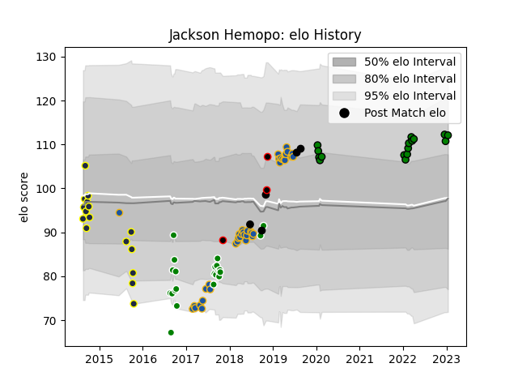

---  
layout: page  
title: Jackson Hemopo  
date: 2022-12-18 16:13:15.078710  
categories: player  
---
# Jackson Hemopo

## Positions: L, FL

## Country: New Zealand

## Current elo: 113.0

## Current Percentile: 89.0

# Elo History

# Match History

| Team                 |   Appearances |   Win Rate |
|:---------------------|--------------:|-----------:|
| Highlanders          |            38 |   0.578947 |
| Manawatu             |            22 |   0.409091 |
| Otago                |            16 |   0.4375   |
| Mitsubishi Dynaboars |            13 |   0.692308 |
| New Zealand          |             4 |   1        |
| New Zealand Maori    |             2 |   1        |

| Opponent                        |   Matches |   Win Rate |
|:--------------------------------|----------:|-----------:|
| Blues                           |         6 |   0.833333 |
| Chiefs                          |         5 |   0.3      |
| Hurricanes                      |         5 |   0.2      |
| Crusaders                       |         5 |   0.2      |
| Southland                       |         5 |   1        |
| Bay of Plenty                   |         4 |   0.25     |
| Northland                       |         4 |   0.75     |
| Waikato                         |         3 |   0.666667 |
| Bulls                           |         3 |   0.833333 |
| New South Wales Waratahs        |         3 |   0.333333 |
| Canterbury                      |         3 |   0.333333 |
| Wellington                      |         3 |   0.333333 |
| Tasman                          |         3 |   0.333333 |
| Queensland Reds                 |         3 |   1        |
| North Harbour                   |         3 |   0.666667 |
| Hawke's Bay                     |         3 |   0        |
| Melbourne Rebels                |         2 |   0.5      |
| Skyactivs Hiroshima             |         2 |   1        |
| Argentina                       |         2 |   1        |
| Hino Red Dolphins               |         2 |   1        |
| Stormers                        |         2 |   1        |
| Otago                           |         2 |   0        |
| Taranaki                        |         2 |   0        |
| Counties Manukau                |         2 |   0        |
| Saitama Wild Knights            |         1 |   0        |
| Toshiba Brave Lupus Tokyo       |         1 |   0        |
| Western Force                   |         1 |   1        |
| Sunwolves                       |         1 |   1        |
| Manawatu                        |         1 |   0        |
| NTT Docomo Red Hurricanes Osaka |         1 |   0        |
| Mie Honda Heat                  |         1 |   1        |
| Kamaishi Seawaves               |         1 |   1        |
| Japan                           |         1 |   1        |
| Hanazono Kintetsu Liners        |         1 |   1        |
| Green Rockets Tokatsu           |         1 |   1        |
| France                          |         1 |   1        |
| Chile                           |         1 |   1        |
| Canada                          |         1 |   1        |
| Brumbies                        |         1 |   1        |
| British and Irish Lions         |         1 |   1        |
| Black Rams Tokyo                |         1 |   1        |
| Yokohama Canon Eagles           |         1 |   0        |