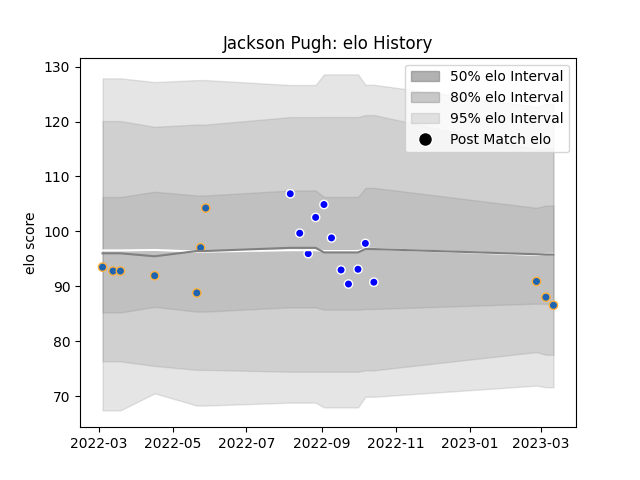

---  
layout: page  
title: Jackson Pugh  
date: 2023-03-17 17:35:15.705484  
categories: player  
---
# Jackson Pugh

## Positions: N8

## Current elo: 87.0

## Current Percentile: 34.0

# Elo History

# Match History

| Team          |   Appearances |   Win Rate |
|:--------------|--------------:|-----------:|
| Auckland      |            11 |   0.545455 |
| Western Force |            10 |   0.5      |

| Opponent                 |   Matches |   Win Rate |
|:-------------------------|----------:|-----------:|
| North Harbour            |         2 |          1 |
| Moana Pasifika           |         2 |          1 |
| New South Wales Waratahs |         2 |          0 |
| Queensland Reds          |         2 |          0 |
| Otago                    |         1 |          1 |
| Waikato                  |         1 |          0 |
| Tasman                   |         1 |          1 |
| Taranaki                 |         1 |          1 |
| Southland                |         1 |          1 |
| Bay of Plenty            |         1 |          0 |
| Northland                |         1 |          0 |
| Canterbury               |         1 |          0 |
| Melbourne Rebels         |         1 |          1 |
| Hurricanes               |         1 |          1 |
| Fijian Drua              |         1 |          1 |
| Chiefs                   |         1 |          0 |
| Wellington               |         1 |          0 |