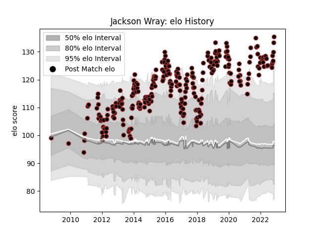

---  
layout: page  
title: Jackson Wray  
date: 2023-02-02 19:12:26.590204  
categories: player  
---
# Jackson Wray

## Positions: FL, N8

## Current elo: 94.0

## Current Percentile: 88.0

# Elo History

# Match History

| Team     |   Appearances |   Win Rate |
|:---------|--------------:|-----------:|
| Saracens |           295 |   0.750847 |

| Opponent            |   Matches |   Win Rate |
|:--------------------|----------:|-----------:|
| Northampton Saints  |        27 |   0.574074 |
| Exeter Chiefs       |        24 |   0.6875   |
| Leicester Tigers    |        21 |   0.666667 |
| Sale Sharks         |        21 |   0.833333 |
| Harlequins          |        20 |   0.75     |
| Wasps               |        19 |   0.789474 |
| London Irish        |        17 |   0.735294 |
| Bath Rugby          |        17 |   0.735294 |
| Newcastle Falcons   |        16 |   1        |
| Worcester Warriors  |        16 |   0.8125   |
| Gloucester Rugby    |        16 |   0.65625  |
| Bristol Rugby       |         9 |   0.777778 |
| Clermont Auvergne   |         7 |   0.428571 |
| Racing 92           |         6 |   0.666667 |
| Scarlets            |         5 |   0.7      |
| Munster             |         5 |   0.6      |
| Toulon              |         4 |   0.5      |
| London Welsh        |         4 |   1        |
| Glasgow Warriors    |         4 |   1        |
| Lyon                |         3 |   1        |
| Leinster            |         3 |   0.666667 |
| Ospreys             |         3 |   1        |
| Stade Toulousain    |         3 |   0.666667 |
| Ulster              |         3 |   1        |
| Edinburgh           |         3 |   0.666667 |
| Oyonnax             |         2 |   1        |
| Zebre               |         2 |   1        |
| Leeds               |         1 |   1        |
| Nottingham          |         1 |   1        |
| Jersey              |         1 |   1        |
| Ealing Trailfinders |         1 |   1        |
| Coventry            |         1 |   1        |
| Richmond            |         1 |   1        |
| Cornish Pirates     |         1 |   0        |
| Connacht            |         1 |   1        |
| Cardiff Blues       |         1 |   1        |
| Brive               |         1 |   1        |
| Biarritz Olympique  |         1 |   1        |
| Benetton Treviso    |         1 |   1        |
| Bedford             |         1 |   1        |
| Yorkshire Carnegie  |         1 |   1        |
| Ampthill            |         1 |   1        |