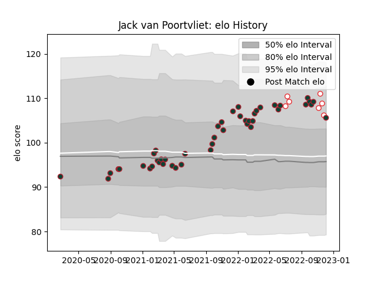

---  
layout: page  
title: Jack van Poortvliet  
date: 2023-01-06 00:20:02.002951  
categories: player  
---
# Jack van Poortvliet

## Positions: SH

## Country: England

## Current elo: 106.0

## Current Percentile: 73.0

# Elo History

# Match History

| Team             |   Appearances |   Win Rate |
|:-----------------|--------------:|-----------:|
| Leicester Tigers |            51 |   0.656863 |
| England          |             7 |   0.5      |

| Opponent           |   Matches |   Win Rate |
|:-------------------|----------:|-----------:|
| Sale Sharks        |         6 |   0        |
| Gloucester Rugby   |         5 |   0.8      |
| Northampton Saints |         5 |   0.8      |
| Worcester Warriors |         4 |   1        |
| Bath Rugby         |         4 |   0.75     |
| Wasps              |         4 |   0.75     |
| Newcastle Falcons  |         4 |   1        |
| Bristol Rugby      |         3 |   0.166667 |
| Exeter Chiefs      |         3 |   0.666667 |
| Harlequins         |         3 |   0.333333 |
| Australia          |         3 |   0.666667 |
| Saracens           |         3 |   0.333333 |
| Connacht           |         2 |   1        |
| London Irish       |         2 |   1        |
| South Africa       |         1 |   0        |
| Argentina          |         1 |   0        |
| Ospreys            |         1 |   1        |
| New Zealand        |         1 |   0.5      |
| Bordeaux Begles    |         1 |   1        |
| Bayonne            |         1 |   1        |
| Japan              |         1 |   1        |