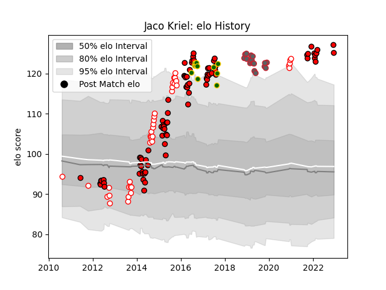

---  
layout: page  
title: Jaco Kriel  
date: 2022-12-09 13:07:27.865595  
categories: player  
---
# Jaco Kriel

## Positions: FL

## Country: South Africa

## Current elo: 127.0

## Current Percentile: 97.0

# Elo History

# Match History

| Team             |   Appearances |   Win Rate |
|:-----------------|--------------:|-----------:|
| Lions            |            81 |   0.574074 |
| Golden Lions     |            39 |   0.666667 |
| Gloucester Rugby |            17 |   0.647059 |
| South Africa     |            11 |   0.590909 |

| Opponent                 |   Matches |   Win Rate |
|:-------------------------|----------:|-----------:|
| Natal Sharks             |         9 |   0.444444 |
| Sharks                   |         9 |   0.666667 |
| Stormers                 |         9 |   0.5      |
| Western Province         |         8 |   0.625    |
| Bulls                    |         8 |   0.375    |
| Blue Bulls               |         6 |   0.666667 |
| Cheetahs                 |         6 |   1        |
| Griquas                  |         5 |   0.6      |
| Free State Cheetahs      |         5 |   0.8      |
| Hurricanes               |         5 |   0.2      |
| Crusaders                |         5 |   0.2      |
| Highlanders              |         4 |   0.5      |
| Southern Kings           |         4 |   1        |
| Queensland Reds          |         4 |   0.75     |
| Argentina                |         4 |   0.75     |
| Blues                    |         4 |   0.75     |
| Pumas                    |         3 |   1        |
| New South Wales Waratahs |         3 |   0.666667 |
| Chiefs                   |         3 |   0.333333 |
| Jaguares                 |         3 |   0.666667 |
| Australia                |         3 |   0.5      |
| Eastern Province Kings   |         3 |   1        |
| Melbourne Rebels         |         3 |   1        |
| Saracens                 |         3 |   0.333333 |
| Sale Sharks              |         2 |   0.5      |
| Newcastle Falcons        |         2 |   1        |
| New Zealand              |         2 |   0        |
| Sunwolves                |         2 |   1        |
| Worcester Warriors       |         2 |   0.5      |
| Western Force            |         2 |   0        |
| Wasps                    |         2 |   1        |
| Scarlets                 |         2 |   0.5      |
| Leicester Tigers         |         1 |   1        |
| Northampton Saints       |         1 |   1        |
| Montpellier Herault      |         1 |   0        |
| Leinster                 |         1 |   0        |
| Ireland                  |         1 |   1        |
| Harlequins               |         1 |   1        |
| Glasgow Warriors         |         1 |   0        |
| France                   |         1 |   1        |
| Cardiff Blues            |         1 |   1        |
| Brumbies                 |         1 |   0        |
| Bristol Rugby            |         1 |   0        |
| Bath Rugby               |         1 |   1        |
| Zebre                    |         1 |   1        |