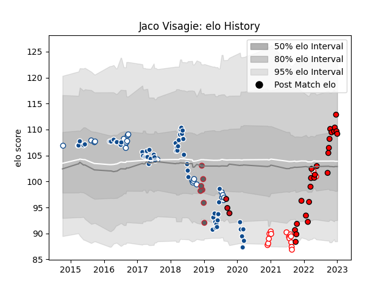

---  
layout: page  
title: Jaco Visagie  
date: 2022-12-18 16:25:36.170625  
categories: player  
---
# Jaco Visagie

## Positions: H

## Current elo: 109.0

## Current Percentile: 85.0

# Elo History

# Match History

| Team             |   Appearances |   Win Rate |
|:-----------------|--------------:|-----------:|
| Bulls            |            58 |   0.387931 |
| Lions            |            23 |   0.565217 |
| Blue Bulls       |            20 |   0.55     |
| Golden Lions     |            13 |   0.5      |
| Gloucester Rugby |             7 |   0.428571 |
| Stade Toulousain |             2 |   0        |

| Opponent                 |   Matches |   Win Rate |
|:-------------------------|----------:|-----------:|
| Stormers                 |        10 |   0.3      |
| Griquas                  |         9 |   0.666667 |
| Jaguares                 |         6 |   0.333333 |
| Western Province         |         6 |   0.333333 |
| Sharks                   |         6 |   0.583333 |
| Queensland Reds          |         5 |   0.6      |
| Highlanders              |         4 |   0.375    |
| Free State Cheetahs      |         4 |   0.375    |
| Lions                    |         4 |   0.25     |
| Melbourne Rebels         |         4 |   0.75     |
| Crusaders                |         4 |   0.25     |
| Natal Sharks             |         4 |   0.5      |
| Pumas                    |         4 |   1        |
| Sunwolves                |         3 |   0.333333 |
| Exeter Chiefs            |         3 |   0.333333 |
| Blue Bulls               |         3 |   0        |
| Blues                    |         3 |   0.166667 |
| Hurricanes               |         3 |   0.333333 |
| New South Wales Waratahs |         2 |   0.5      |
| Scarlets                 |         2 |   0.5      |
| Ospreys                  |         2 |   1        |
| Golden Lions             |         2 |   0.5      |
| Ulster                   |         2 |   0        |
| Dragons                  |         2 |   1        |
| Chiefs                   |         2 |   0        |
| Cheetahs                 |         2 |   0.5      |
| Cardiff Blues            |         2 |   1        |
| Brumbies                 |         2 |   0        |
| Stade Francais Paris     |         1 |   1        |
| Sale Sharks              |         1 |   0        |
| Southern Kings           |         1 |   0        |
| Western Force            |         1 |   1        |
| Worcester Warriors       |         1 |   1        |
| Benetton Treviso         |         1 |   1        |
| Leicester Tigers         |         1 |   0        |
| Newcastle Falcons        |         1 |   1        |
| Munster                  |         1 |   1        |
| Leinster                 |         1 |   0        |
| La Rochelle              |         1 |   0        |
| Glasgow Warriors         |         1 |   0        |
| Edinburgh                |         1 |   1        |
| Eastern Province Kings   |         1 |   1        |
| Connacht                 |         1 |   0        |
| Bulls                    |         1 |   0        |
| Brive                    |         1 |   0        |
| Zebre                    |         1 |   1        |