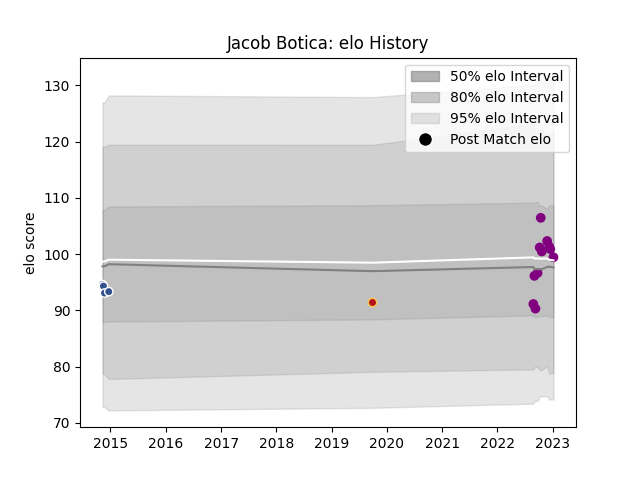

---  
layout: page  
title: Jacob Botica  
date: 2023-03-21 18:25:29.285770  
categories: player  
---
# Jacob Botica

Last updated: 2023-03-21
## Positions: FH

## Current elo: 88.0

## Current Percentile: 30.0

# Elo History

# Match History

| Team             |   Appearances |   Win Rate |
|:-----------------|--------------:|-----------:|
| Dragons          |            14 |        0.5 |
| Soyaux-Angouleme |            10 |        0.4 |
| Agen             |             4 |        0.5 |
| Scarlets         |             1 |        0   |

| Opponent           |   Matches |   Win Rate |
|:-------------------|----------:|-----------:|
| Massy              |         2 |        1   |
| Montauban          |         2 |        0.5 |
| Worcester Warriors |         2 |        0.5 |
| Biarritz Olympique |         2 |        0   |
| Castres Olympique  |         2 |        0.5 |
| RC Enisei          |         2 |        1   |
| Vannes             |         1 |        1   |
| Scarlets           |         1 |        1   |
| Rouen              |         1 |        0   |
| Ospreys            |         1 |        1   |
| Nevers             |         1 |        0   |
| Munster            |         1 |        0   |
| Albi               |         1 |        0   |
| Mont-de-Marsan     |         1 |        0   |
| Aurillac           |         1 |        0   |
| Harlequins         |         1 |        0   |
| Glasgow Warriors   |         1 |        0   |
| Cheetahs           |         1 |        1   |
| Cardiff Blues      |         1 |        0   |
| Carcassonne        |         1 |        1   |
| Beziers            |         1 |        1   |
| Benetton Treviso   |         1 |        0   |
| Zebre              |         1 |        0   |