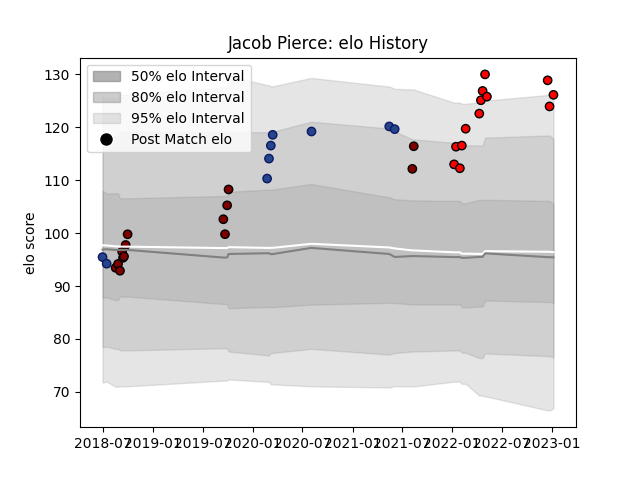

---  
layout: page  
title: Jacob Pierce  
date: 2023-03-17 17:42:19.075950  
categories: player  
---
# Jacob Pierce

## Positions: L

## Current elo: 128.0

## Current Percentile: 94.0

# Elo History

# Match History

| Team                      |   Appearances |   Win Rate |
|:--------------------------|--------------:|-----------:|
| North Harbour             |            14 |   0.571429 |
| Toshiba Brave Lupus Tokyo |            12 |   0.583333 |
| Blues                     |             9 |   0.888889 |

| Opponent                        |   Matches |   Win Rate |
|:--------------------------------|----------:|-----------:|
| Tokyo Sungoliath                |         3 |   0.333333 |
| NTT Docomo Red Hurricanes Osaka |         2 |   1        |
| Queensland Reds                 |         2 |   1        |
| Waikato                         |         2 |   0.5      |
| Toyota Verblitz                 |         2 |   0.5      |
| Tasman                          |         2 |   0        |
| Shizuoka Blue Revs              |         2 |   1        |
| Saitama Wild Knights            |         2 |   0        |
| Wellington                      |         2 |   0.5      |
| Lions                           |         1 |   1        |
| Manawatu                        |         1 |   1        |
| Melbourne Rebels                |         1 |   1        |
| Black Rams Tokyo                |         1 |   1        |
| Northland                       |         1 |   1        |
| Otago                           |         1 |   0        |
| Hurricanes                      |         1 |   1        |
| Highlanders                     |         1 |   1        |
| Hawke's Bay                     |         1 |   1        |
| Stormers                        |         1 |   1        |
| Taranaki                        |         1 |   1        |
| Crusaders                       |         1 |   0        |
| Counties Manukau                |         1 |   1        |
| Canterbury                      |         1 |   0        |
| Bulls                           |         1 |   1        |
| Bay of Plenty                   |         1 |   1        |