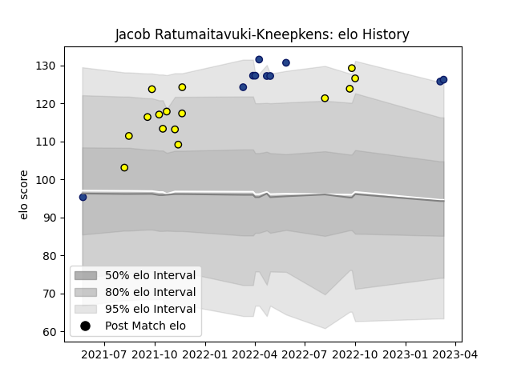

---  
layout: page  
title: Jacob Ratumaitavuki-Kneepkens  
date: 2023-03-06 11:28:21.617324  
categories: player  
---
# Jacob Ratumaitavuki-Kneepkens

## Positions: W, FB

## Current elo: 127.0

## Current Percentile: 95.0

# Elo History

# Match History

| Team     |   Appearances |   Win Rate |
|:---------|--------------:|-----------:|
| Taranaki |            15 |        0.8 |
| Blues    |             8 |        1   |

| Opponent                 |   Matches |   Win Rate |
|:-------------------------|----------:|-----------:|
| Otago                    |         3 |        1   |
| Moana Pasifika           |         2 |        1   |
| New South Wales Waratahs |         2 |        1   |
| Southland                |         2 |        1   |
| Northland                |         2 |        0.5 |
| Wellington               |         1 |        1   |
| Waikato                  |         1 |        1   |
| North Harbour            |         1 |        0   |
| Auckland                 |         1 |        0   |
| Bay of Plenty            |         1 |        1   |
| Manawatu                 |         1 |        1   |
| Highlanders              |         1 |        1   |
| Hawke's Bay              |         1 |        1   |
| Fijian Drua              |         1 |        1   |
| Counties Manukau         |         1 |        1   |
| Chiefs                   |         1 |        1   |
| Western Force            |         1 |        1   |