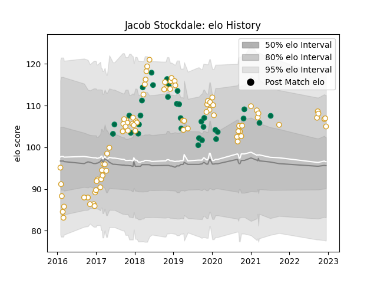

---  
layout: page  
title: Jacob Stockdale  
date: 2023-01-06 00:23:08.823773  
categories: player  
---
# Jacob Stockdale

## Positions: W, FB

## Country: Ireland

## Current elo: 120.0

## Current Percentile: 90.0

# Elo History

# Match History

| Team    |   Appearances |   Win Rate |
|:--------|--------------:|-----------:|
| Ulster  |            82 |   0.609756 |
| Ireland |            32 |   0.75     |

| Opponent                 |   Matches |   Win Rate |
|:-------------------------|----------:|-----------:|
| Leinster                 |        10 |   0.1      |
| Munster                  |         6 |   0.416667 |
| Connacht                 |         6 |   0.5      |
| Scarlets                 |         6 |   0.666667 |
| Glasgow Warriors         |         6 |   0.666667 |
| Edinburgh                |         5 |   0.8      |
| England                  |         5 |   0.4      |
| Benetton Treviso         |         5 |   1        |
| Clermont Auvergne        |         4 |   0.5      |
| Dragons                  |         4 |   1        |
| Cardiff Blues            |         4 |   0.375    |
| Ospreys                  |         4 |   1        |
| Scotland                 |         4 |   1        |
| Wales                    |         4 |   0.75     |
| Harlequins               |         4 |   1        |
| Italy                    |         4 |   1        |
| Zebre                    |         4 |   1        |
| France                   |         3 |   0.666667 |
| Japan                    |         3 |   0.666667 |
| Racing 92                |         2 |   0.5      |
| Wasps                    |         2 |   0.5      |
| Argentina                |         2 |   1        |
| New Zealand              |         2 |   0.5      |
| Leicester Tigers         |         2 |   1        |
| Australia                |         2 |   0.5      |
| Bath Rugby               |         2 |   1        |
| La Rochelle              |         2 |   0.5      |
| Sale Sharks              |         1 |   0        |
| Samoa                    |         1 |   1        |
| Exeter Chiefs            |         1 |   0        |
| South Africa             |         1 |   1        |
| Stade Toulousain         |         1 |   0        |
| United States of America |         1 |   1        |
| Bordeaux Begles          |         1 |   0        |