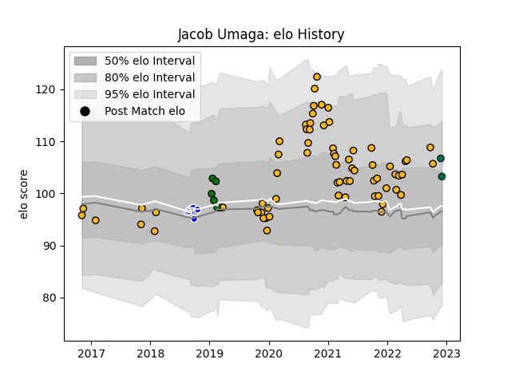

---  
layout: page  
title: Jacob Umaga  
date: 2022-12-09 13:08:45.728923  
categories: player  
---
# Jacob Umaga

## Positions: FH, FB

## Current elo: 103.0

## Current Percentile: 77.0

# Elo History

# Match History

| Team               |   Appearances |   Win Rate |
|:-------------------|--------------:|-----------:|
| Wasps              |            70 |   0.464286 |
| Auckland           |            10 |   0.9      |
| Yorkshire Carnegie |             5 |   0.6      |
| Benetton Treviso   |             2 |   0.5      |

| Opponent            |   Matches |   Win Rate |
|:--------------------|----------:|-----------:|
| Exeter Chiefs       |         7 |   0.285714 |
| Northampton Saints  |         7 |   0.285714 |
| Bristol Rugby       |         7 |   0.714286 |
| London Irish        |         7 |   0.5      |
| Worcester Warriors  |         6 |   0.833333 |
| Leicester Tigers    |         6 |   0.333333 |
| Harlequins          |         6 |   0.166667 |
| Gloucester Rugby    |         6 |   0.333333 |
| Bath Rugby          |         5 |   1        |
| Newcastle Falcons   |         5 |   0.2      |
| Edinburgh           |         2 |   0.5      |
| Wellington          |         2 |   1        |
| Sale Sharks         |         2 |   0        |
| Ealing Trailfinders |         1 |   0        |
| Waikato             |         1 |   1        |
| Tasman              |         1 |   1        |
| Taranaki            |         1 |   1        |
| Stade Toulousain    |         1 |   1        |
| Saracens            |         1 |   1        |
| Richmond            |         1 |   1        |
| Otago               |         1 |   0        |
| Ospreys             |         1 |   1        |
| Nottingham          |         1 |   1        |
| Northland           |         1 |   1        |
| Bordeaux Begles     |         1 |   0        |
| North Harbour       |         1 |   1        |
| Canterbury          |         1 |   1        |
| Connacht            |         1 |   0        |
| Cornish Pirates     |         1 |   1        |
| Jersey              |         1 |   0        |
| Counties Manukau    |         1 |   1        |
| Agen                |         1 |   1        |