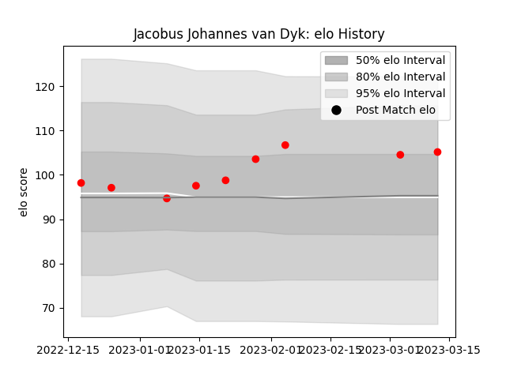

---  
layout: page  
title: Jacobus Johannes van Dyk  
date: 2023-03-17 17:09:22.726059  
categories: player  
---
# Jacobus Johannes van Dyk

## Positions: L, FL

## Current elo: 105.0

## Current Percentile: 79.0

# Elo History

# Match History

| Team                  |   Appearances |   Win Rate |
|:----------------------|--------------:|-----------:|
| Yokohama Canon Eagles |             9 |   0.666667 |

| Opponent                          |   Matches |   Win Rate |
|:----------------------------------|----------:|-----------:|
| Black Rams Tokyo                  |         1 |        1   |
| Green Rockets Tokatsu             |         1 |        1   |
| Hanazono Kintetsu Liners          |         1 |        1   |
| Kobelco Kobe Steelers             |         1 |        1   |
| Kubota Spears Funabashi Tokyo-Bay |         1 |        0.5 |
| Mitsubishi Dynaboars              |         1 |        1   |
| Saitama Wild Knights              |         1 |        0   |
| Shizuoka Blue Revs                |         1 |        0.5 |
| Tokyo Sungoliath                  |         1 |        0   |