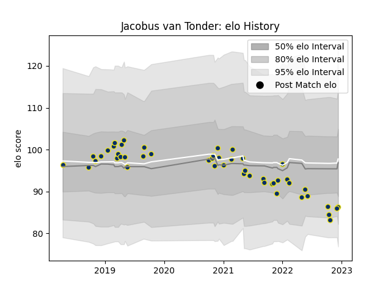

---  
layout: page  
title: Jacobus van Tonder  
date: 2022-12-14 11:34:25.001491  
categories: player  
---
# Jacobus van Tonder

## Positions: FL, L

## Current elo: 86.0

## Current Percentile: 13.0

# Elo History

# Match History

| Team              |   Appearances |   Win Rate |
|:------------------|--------------:|-----------:|
| Clermont Auvergne |            48 |   0.614583 |

| Opponent             |   Matches |   Win Rate |
|:---------------------|----------:|-----------:|
| Bordeaux Begles      |         6 |   0.25     |
| Agen                 |         3 |   1        |
| Montpellier Herault  |         3 |   0.666667 |
| Stade Toulousain     |         3 |   0.333333 |
| Racing 92            |         3 |   0.166667 |
| Perpignan            |         3 |   0.666667 |
| Pau                  |         3 |   0.666667 |
| Toulon               |         3 |   0.666667 |
| Brive                |         3 |   0.666667 |
| La Rochelle          |         2 |   0.5      |
| Bayonne              |         2 |   1        |
| Grenoble             |         2 |   0.75     |
| Castres Olympique    |         2 |   0.5      |
| Stade Francais Paris |         2 |   1        |
| Biarritz Olympique   |         2 |   1        |
| Timisoara Saracens   |         2 |   1        |
| Lyon                 |         2 |   0        |
| Dragons              |         1 |   1        |
| Stormers             |         1 |   1        |