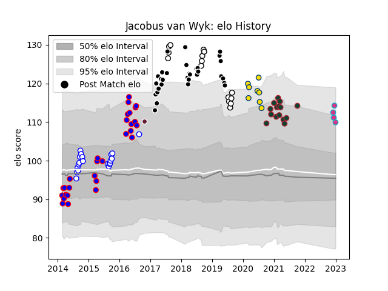

---  
layout: page  
title: Jacobus van Wyk  
date: 2023-02-02 18:42:26.906363  
categories: player  
---
# Jacobus van Wyk

## Positions: W

## Current elo: 130.0

## Current Percentile: 95.0

# Elo History

# Match History

| Team             |   Appearances |   Win Rate |
|:-----------------|--------------:|-----------:|
| Sharks           |            31 |   0.435484 |
| Stormers         |            29 |   0.5      |
| Western Province |            20 |   0.8      |
| Leicester Tigers |            15 |   0.533333 |
| Natal Sharks     |            15 |   0.8      |
| Hurricanes       |             8 |   0.75     |
| Zebre            |             6 |   0        |
| Bordeaux Begles  |             1 |   0        |

| Opponent                 |   Matches |   Win Rate |
|:-------------------------|----------:|-----------:|
| Lions                    |         9 |   0.333333 |
| Blue Bulls               |         7 |   1        |
| Chiefs                   |         7 |   0.428571 |
| Golden Lions             |         6 |   0.666667 |
| Free State Cheetahs      |         6 |   0.666667 |
| Pumas                    |         5 |   0.8      |
| New South Wales Waratahs |         5 |   0.5      |
| Hurricanes               |         4 |   0.25     |
| Griquas                  |         4 |   0.75     |
| Sunwolves                |         4 |   0.875    |
| Jaguares                 |         4 |   0.75     |
| Western Force            |         4 |   1        |
| Cheetahs                 |         4 |   0.75     |
| Brumbies                 |         4 |   0.5      |
| Eastern Province Kings   |         3 |   1        |
| Crusaders                |         3 |   0        |
| Bulls                    |         3 |   0        |
| Southern Kings           |         3 |   0.666667 |
| Highlanders              |         3 |   0.666667 |
| Western Province         |         3 |   0.666667 |
| Blues                    |         3 |   0.666667 |
| Queensland Reds          |         3 |   0.333333 |
| Stormers                 |         2 |   0.5      |
| Sale Sharks              |         2 |   0        |
| Toulon                   |         2 |   0        |
| Worcester Warriors       |         2 |   1        |
| Melbourne Rebels         |         2 |   0.5      |
| London Irish             |         2 |   0.5      |
| Gloucester Rugby         |         2 |   1        |
| Bristol Rugby            |         2 |   0        |
| Natal Sharks             |         1 |   1        |
| Northampton Saints       |         1 |   0        |
| Ospreys                  |         1 |   0        |
| Benetton Treviso         |         1 |   0        |
| Saracens                 |         1 |   1        |
| Sharks                   |         1 |   0        |
| Harlequins               |         1 |   0        |
| Glasgow Warriors         |         1 |   0        |
| Exeter Chiefs            |         1 |   0        |
| Wasps                    |         1 |   1        |
| Clermont Auvergne        |         1 |   0        |
| Bath Rugby               |         1 |   1        |