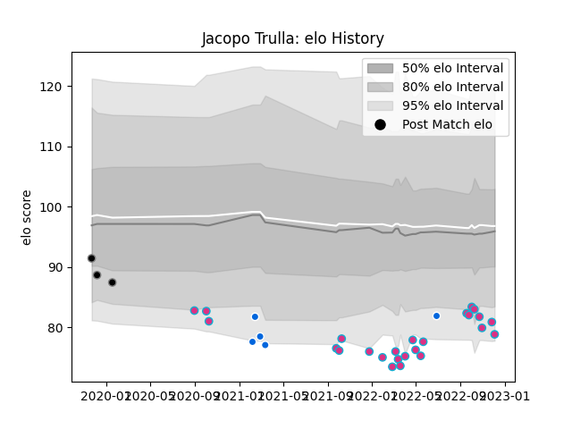

---  
layout: page  
title: Jacopo Trulla  
date: 2022-12-09 13:13:50.988584  
categories: player  
---
# Jacopo Trulla

## Positions: FB, W

## Country: Italy

## Current elo: 79.0

## Current Percentile: 7.0

# Elo History

# Match History

| Team      |   Appearances |   Win Rate |
|:----------|--------------:|-----------:|
| Zebre     |            25 |       0.04 |
| Italy     |             5 |       0.2  |
| Calvisano |             3 |       0    |

| Opponent         |   Matches |   Win Rate |
|:-----------------|----------:|-----------:|
| Benetton Treviso |         3 |   0        |
| Dragons          |         3 |   0.333333 |
| Munster          |         2 |   0        |
| Cardiff Blues    |         2 |   0        |
| Ulster           |         2 |   0        |
| Edinburgh        |         2 |   0        |
| Stormers         |         2 |   0        |
| Sharks           |         2 |   0        |
| Glasgow Warriors |         2 |   0        |
| Leinster         |         2 |   0        |
| Portugal         |         1 |   1        |
| Pau              |         1 |   0        |
| Ospreys          |         1 |   0        |
| Leicester Tigers |         1 |   0        |
| Lions            |         1 |   0        |
| Bulls            |         1 |   0        |
| Ireland          |         1 |   0        |
| France           |         1 |   0        |
| England          |         1 |   0        |
| Connacht         |         1 |   0        |
| Wales            |         1 |   0        |