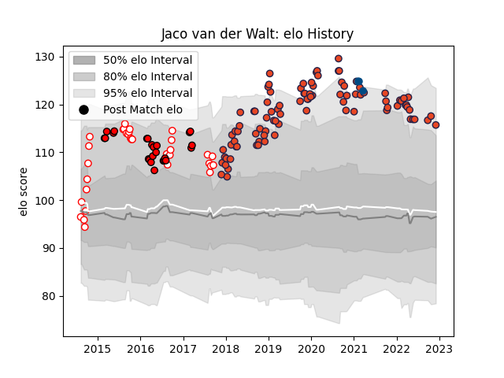

---  
layout: page  
title: Jaco van der Walt  
date: 2022-12-09 13:05:27.319621  
categories: player  
---
# Jaco van der Walt

## Positions: FH, FB

## Country: Scotland

## Current elo: 116.0

## Current Percentile: 92.0

# Elo History

# Match History

| Team         |   Appearances |   Win Rate |
|:-------------|--------------:|-----------:|
| Edinburgh    |            93 |   0.569892 |
| Golden Lions |            32 |   0.75     |
| Lions        |            24 |   0.666667 |
| Scotland     |             3 |   0.666667 |

| Opponent                 |   Matches |   Win Rate |
|:-------------------------|----------:|-----------:|
| Glasgow Warriors         |        14 |   0.642857 |
| Munster                  |         8 |   0.25     |
| Scarlets                 |         7 |   0.857143 |
| Southern Kings           |         6 |   0.833333 |
| Natal Sharks             |         6 |   0.666667 |
| Western Province         |         6 |   0.666667 |
| Ulster                   |         6 |   0.166667 |
| Free State Cheetahs      |         5 |   0.6      |
| Cardiff Blues            |         5 |   0.6      |
| Cheetahs                 |         5 |   0.8      |
| Connacht                 |         5 |   0.8      |
| Dragons                  |         5 |   0.6      |
| Griquas                  |         5 |   0.8      |
| Stormers                 |         4 |   0.375    |
| Leinster                 |         4 |   0.5      |
| Zebre                    |         4 |   1        |
| Eastern Province Kings   |         4 |   1        |
| Bordeaux Begles          |         3 |   0.166667 |
| Blue Bulls               |         3 |   0.666667 |
| Pumas                    |         3 |   1        |
| Jaguares                 |         3 |   0.333333 |
| Ospreys                  |         3 |   0        |
| Benetton Treviso         |         3 |   0        |
| Montpellier Herault      |         2 |   0.5      |
| Stade Francais Paris     |         2 |   0.5      |
| Newcastle Falcons        |         2 |   1        |
| Blues                    |         2 |   1        |
| Highlanders              |         2 |   0.5      |
| Bulls                    |         2 |   0.5      |
| Toulon                   |         2 |   1        |
| Wasps                    |         2 |   1        |
| Crusaders                |         2 |   0.5      |
| Hurricanes               |         2 |   0        |
| Sharks                   |         2 |   1        |
| Sunwolves                |         1 |   1        |
| Wales                    |         1 |   0        |
| Agen                     |         1 |   1        |
| Queensland Reds          |         1 |   1        |
| Pau                      |         1 |   1        |
| New South Wales Waratahs |         1 |   1        |
| Melbourne Rebels         |         1 |   1        |
| London Irish             |         1 |   1        |
| Italy                    |         1 |   1        |
| England                  |         1 |   1        |
| Chiefs                   |         1 |   1        |
| Brumbies                 |         1 |   0        |
| Lions                    |         1 |   0        |