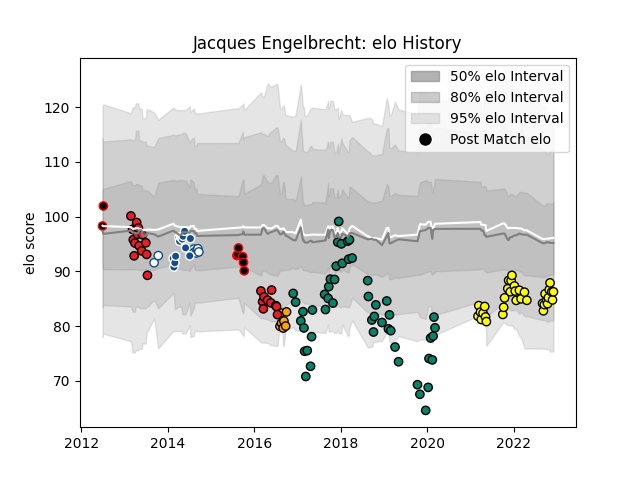

---  
layout: page  
title: Jacques Engelbrecht  
date: 2023-01-17 11:41:17.956371  
categories: player  
---
# Jacques Engelbrecht

## Positions: N8, FL

## Current elo: 96.0

## Current Percentile: 65.0

# Elo History

# Match History

| Team                   |   Appearances |   Win Rate |
|:-----------------------|--------------:|-----------:|
| Montauban              |            75 |   0.54     |
| Albi                   |            46 |   0.684783 |
| Southern Kings         |            25 |   0.14     |
| Blue Bulls             |            14 |   0.285714 |
| Bulls                  |            14 |   0.428571 |
| Eastern Province Kings |             9 |   0.333333 |
| Boland Cavaliers       |             7 |   0.285714 |

| Opponent                   |   Matches |   Win Rate |
|:---------------------------|----------:|-----------:|
| Carcassonne                |         6 |   0.833333 |
| Dax                        |         6 |   0.833333 |
| Biarritz Olympique         |         6 |   0.333333 |
| Perpignan                  |         6 |   0.166667 |
| Bourgoin-Jallieu           |         5 |   0.8      |
| Golden Lions               |         5 |   0.2      |
| Mont-de-Marsan             |         5 |   0.2      |
| Natal Sharks               |         5 |   0        |
| Colomiers                  |         5 |   0.6      |
| Oyonnax                    |         5 |   0.5      |
| Sharks                     |         5 |   0        |
| Western Province           |         5 |   0        |
| Blagnac                    |         5 |   0.6      |
| Aurillac                   |         5 |   0.7      |
| Beziers                    |         5 |   0.5      |
| Stormers                   |         5 |   0.2      |
| Cognac Saint Jean d'Angély |         4 |   1        |
| Massy                      |         4 |   0.75     |
| Narbonne                   |         4 |   1        |
| Soyaux-Angouleme           |         4 |   0.25     |
| Tarbes                     |         4 |   0.25     |
| Cheetahs                   |         4 |   0.25     |
| Lions                      |         4 |   0.25     |
| Nice                       |         3 |   0.166667 |
| Suresnes                   |         3 |   0.666667 |
| US Bressane                |         3 |   0.666667 |
| Provence Rugby             |         3 |   0.333333 |
| Hurricanes                 |         3 |   0        |
| Vannes                     |         3 |   0.666667 |
| Pumas                      |         3 |   0.333333 |
| Griquas                    |         3 |   0.666667 |
| Chambery                   |         3 |   1        |
| Grenoble                   |         3 |   0.666667 |
| Aubenas                    |         3 |   1        |
| Free State Cheetahs        |         3 |   0.333333 |
| Bayonne                    |         3 |   0.333333 |
| Highlanders                |         2 |   0        |
| Western Force              |         2 |   0.5      |
| Valence Romans Drome Rugby |         2 |   0.5      |
| Blue Bulls                 |         2 |   0        |
| Brive                      |         2 |   0.5      |
| Brumbies                   |         2 |   0.75     |
| Rennes                     |         2 |   1        |
| Bulls                      |         2 |   0        |
| Chiefs                     |         2 |   0        |
| Crusaders                  |         2 |   0        |
| New South Wales Waratahs   |         2 |   0        |
| Dijon                      |         2 |   1        |
| Eastern Province Kings     |         2 |   1        |
| Melbourne Rebels           |         2 |   1        |
| Albi                       |         2 |   1        |
| Agen                       |         2 |   0        |
| Carqueiranne-Hyères        |         1 |   0        |
| Jaguares                   |         1 |   1        |
| Roval Drome XV             |         1 |   1        |
| SWD Eagles                 |         1 |   1        |
| Boland Cavaliers           |         1 |   1        |
| Blues                      |         1 |   1        |
| Nevers                     |         1 |   1        |