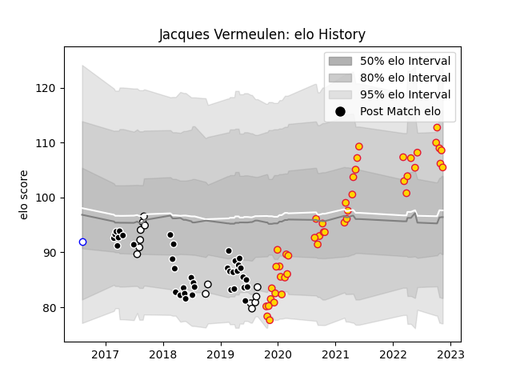

---  
layout: page  
title: Jacques Vermeulen  
date: 2022-11-15 23:37:41.923217  
categories: player  
---
# Jacques Vermeulen

## Positions: FL

## Current elo: 105.0

## Current Percentile: 83.0

# Elo History

# Match History

| Team             |   Appearances |   Win Rate |
|:-----------------|--------------:|-----------:|
| Exeter Chiefs    |            46 |   0.706522 |
| Sharks           |            37 |   0.472973 |
| Natal Sharks     |            14 |   0.785714 |
| Western Province |             1 |   0        |

| Opponent                 |   Matches |   Win Rate |
|:-------------------------|----------:|-----------:|
| Sale Sharks              |         7 |   0.571429 |
| Bath Rugby               |         5 |   0.8      |
| Lions                    |         5 |   0.6      |
| Harlequins               |         4 |   0.75     |
| Stormers                 |         4 |   0.5      |
| Worcester Warriors       |         4 |   0.75     |
| Bristol Rugby            |         4 |   0.5      |
| Bulls                    |         4 |   0        |
| Melbourne Rebels         |         3 |   0.5      |
| Jaguares                 |         3 |   0.333333 |
| Western Province         |         3 |   0.666667 |
| Saracens                 |         3 |   0.333333 |
| Northampton Saints       |         3 |   0.666667 |
| New South Wales Waratahs |         3 |   0.833333 |
| Brumbies                 |         3 |   0.333333 |
| Blue Bulls               |         3 |   0.666667 |
| Leicester Tigers         |         3 |   0.666667 |
| Griquas                  |         3 |   0.666667 |
| Free State Cheetahs      |         3 |   0.666667 |
| Gloucester Rugby         |         3 |   0.666667 |
| La Rochelle              |         2 |   1        |
| Glasgow Warriors         |         2 |   0.75     |
| Crusaders                |         2 |   0.25     |
| Wasps                    |         2 |   1        |
| Sunwolves                |         2 |   1        |
| Queensland Reds          |         2 |   0        |
| Golden Lions             |         2 |   1        |
| Chiefs                   |         2 |   0.5      |
| London Irish             |         2 |   1        |
| Hurricanes               |         1 |   0        |
| Racing 92                |         1 |   1        |
| Pumas                    |         1 |   1        |
| Newcastle Falcons        |         1 |   1        |
| Southern Kings           |         1 |   1        |
| Blues                    |         1 |   1        |
| Cheetahs                 |         1 |   1        |