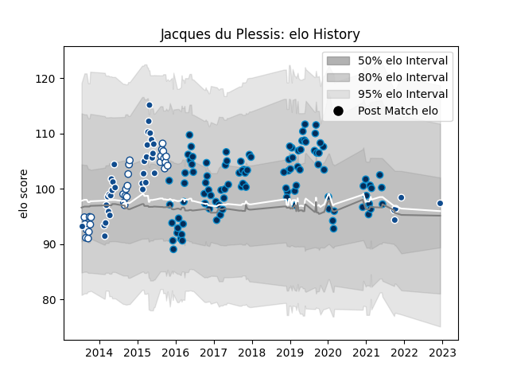

---  
layout: page  
title: Jacques du Plessis  
date: 2022-12-14 11:24:36.466509  
categories: player  
---
# Jacques du Plessis

## Positions: L, FL

## Current elo: 97.0

## Current Percentile: None

# Elo History

# Match History

| Team                |   Appearances |   Win Rate |
|:--------------------|--------------:|-----------:|
| Montpellier Herault |           102 |   0.563725 |
| Bulls               |            36 |   0.430556 |
| Blue Bulls          |            29 |   0.534483 |

| Opponent                 |   Matches |   Win Rate |
|:-------------------------|----------:|-----------:|
| Toulon                   |         9 |   0.555556 |
| Western Province         |         8 |   0.1875   |
| Stade Toulousain         |         8 |   0.5      |
| Castres Olympique        |         8 |   0.5      |
| Racing 92                |         7 |   0.285714 |
| Pau                      |         7 |   0.571429 |
| Lyon                     |         7 |   0.428571 |
| Clermont Auvergne        |         7 |   0.714286 |
| La Rochelle              |         6 |   0.5      |
| Grenoble                 |         5 |   0.8      |
| Stade Francais Paris     |         5 |   0.6      |
| Sharks                   |         5 |   0.6      |
| Griquas                  |         5 |   1        |
| Agen                     |         5 |   0.8      |
| Bordeaux Begles          |         5 |   0.5      |
| Brive                    |         4 |   0.75     |
| Cheetahs                 |         4 |   0.5      |
| Free State Cheetahs      |         4 |   0.75     |
| Lions                    |         4 |   0.5      |
| Stormers                 |         4 |   0.25     |
| Golden Lions             |         4 |   0.25     |
| Natal Sharks             |         4 |   0.25     |
| Leinster                 |         3 |   0.333333 |
| Eastern Province Kings   |         3 |   1        |
| Bayonne                  |         3 |   1        |
| Brumbies                 |         2 |   0.5      |
| Cardiff Blues            |         2 |   0.5      |
| Oyonnax                  |         2 |   1        |
| Blues                    |         2 |   0.5      |
| Western Force            |         2 |   0.5      |
| Northampton Saints       |         2 |   0.5      |
| Harlequins               |         2 |   1        |
| Chiefs                   |         2 |   0.25     |
| Hurricanes               |         2 |   0        |
| Connacht                 |         2 |   0        |
| Gloucester Rugby         |         2 |   0.5      |
| New South Wales Waratahs |         1 |   0        |
| Edinburgh                |         1 |   0        |
| Perpignan                |         1 |   0        |
| Pumas                    |         1 |   1        |
| Queensland Reds          |         1 |   1        |
| Calvisano                |         1 |   1        |
| Highlanders              |         1 |   0        |
| Crusaders                |         1 |   1        |
| Glasgow Warriors         |         1 |   1        |
| Exeter Chiefs            |         1 |   0        |
| Melbourne Rebels         |         1 |   0        |