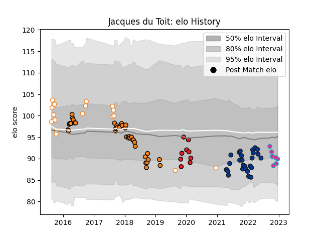

---  
layout: page  
title: Jacques du Toit  
date: 2022-12-12 15:35:34.407160  
categories: player  
---
# Jacques du Toit

## Positions: H

## Current elo: 89.0

## Current Percentile: 25.0

# Elo History

# Match History

| Team                |   Appearances |   Win Rate |
|:--------------------|--------------:|-----------:|
| Cheetahs            |            40 |   0.3875   |
| Bath Rugby          |            27 |   0.240741 |
| Free State Cheetahs |            17 |   0.617647 |
| Southern Kings      |             9 |   0.111111 |
| Zebre               |             6 |   0        |

| Opponent               |   Matches |   Win Rate |
|:-----------------------|----------:|-----------:|
| Glasgow Warriors       |         5 |   0        |
| Scarlets               |         5 |   0.2      |
| Southern Kings         |         4 |   1        |
| Munster                |         4 |   0        |
| Griquas                |         4 |   0.75     |
| Golden Lions           |         4 |   0.25     |
| Ospreys                |         4 |   0.5      |
| Connacht               |         3 |   0.333333 |
| Ulster                 |         3 |   0.166667 |
| Bristol Rugby          |         3 |   0.333333 |
| Pumas                  |         3 |   1        |
| Sale Sharks            |         3 |   0.166667 |
| Leicester Tigers       |         3 |   0.333333 |
| Harlequins             |         3 |   0.333333 |
| Western Province       |         3 |   0.666667 |
| Cardiff Blues          |         3 |   0.333333 |
| Wasps                  |         3 |   0        |
| Northampton Saints     |         3 |   0.333333 |
| Stormers               |         3 |   0        |
| Edinburgh              |         3 |   0.333333 |
| Worcester Warriors     |         2 |   0.5      |
| Saracens               |         2 |   0        |
| Sunwolves              |         2 |   1        |
| Benetton Treviso       |         2 |   0        |
| Zebre                  |         2 |   1        |
| Newcastle Falcons      |         2 |   0.5      |
| Leinster               |         2 |   0.5      |
| Gloucester Rugby       |         2 |   0        |
| Dragons                |         2 |   0.5      |
| Cheetahs               |         2 |   0        |
| Natal Sharks           |         1 |   0.5      |
| Melbourne Rebels       |         1 |   0        |
| Queensland Reds        |         1 |   0        |
| Blue Bulls             |         1 |   1        |
| Jaguares               |         1 |   0        |
| Exeter Chiefs          |         1 |   0        |
| Eastern Province Kings |         1 |   0        |
| Bulls                  |         1 |   0        |
| Brumbies               |         1 |   0        |
| Lions                  |         1 |   0        |