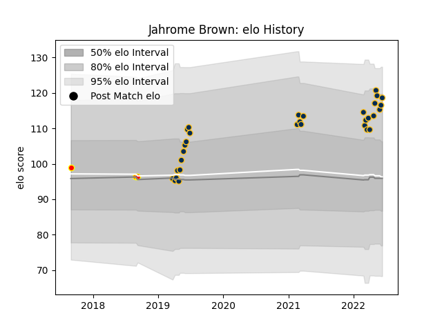

---  
layout: page  
title: Jahrome Brown  
date: 2023-03-24 11:46:19.699141  
categories: player  
---
# Jahrome Brown

Last updated: 2023-03-24
## Positions: FL

## Current elo: 119.0

## Current Percentile: 86.0

# Elo History

# Match History

| Team     |   Appearances |   Win Rate |
|:---------|--------------:|-----------:|
| Brumbies |            31 |   0.709677 |
| Waikato  |             3 |   0.666667 |

| Opponent                 |   Matches |   Win Rate |
|:-------------------------|----------:|-----------:|
| Queensland Reds          |         5 |        0.4 |
| Western Force            |         3 |        1   |
| New South Wales Waratahs |         3 |        1   |
| Jaguares                 |         2 |        0   |
| Sunwolves                |         2 |        1   |
| Melbourne Rebels         |         2 |        1   |
| Blues                    |         2 |        0.5 |
| Auckland                 |         2 |        0.5 |
| Hurricanes               |         2 |        1   |
| Crusaders                |         2 |        0   |
| Highlanders              |         1 |        1   |
| Fijian Drua              |         1 |        1   |
| Moana Pasifika           |         1 |        0   |
| Chiefs                   |         1 |        1   |
| Sharks                   |         1 |        1   |
| Stormers                 |         1 |        1   |
| Bulls                    |         1 |        1   |
| Taranaki                 |         1 |        1   |
| Lions                    |         1 |        1   |