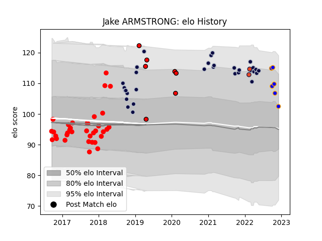

---  
layout: page  
title: Jake ARMSTRONG  
date: 2023-02-05 15:09:59.776387  
categories: player  
---
# Jake ARMSTRONG

## Positions: P

## Current elo: 114.0

## Current Percentile: 84.0

# Elo History

# Match History

| Team             |   Appearances |   Win Rate |
|:-----------------|--------------:|-----------:|
| Jersey           |            35 |   0.614286 |
| Bristol Rugby    |            31 |   0.532258 |
| Doncaster        |            12 |   0.583333 |
| Hartpury College |             7 |   0.142857 |
| Edinburgh        |             2 |   0        |

| Opponent               |   Matches |   Win Rate |
|:-----------------------|----------:|-----------:|
| Nottingham             |         7 |   0.5      |
| London Scottish        |         6 |   0.833333 |
| Cornish Pirates        |         5 |   0.8      |
| Richmond               |         5 |   0.8      |
| Yorkshire Carnegie     |         4 |   0.25     |
| Ealing Trailfinders    |         4 |   0        |
| London Irish           |         4 |   0.625    |
| Rotherham Titans       |         3 |   1        |
| La Rochelle            |         3 |   0.333333 |
| Bedford                |         3 |   0.666667 |
| Wasps                  |         3 |   0.333333 |
| Doncaster              |         3 |   0.333333 |
| Gloucester Rugby       |         3 |   0.666667 |
| Hartpury College       |         3 |   0.666667 |
| Bath Rugby             |         3 |   0.666667 |
| Leicester Tigers       |         2 |   0.5      |
| RC Enisei              |         2 |   1        |
| Newcastle Falcons      |         2 |   0.5      |
| Saracens               |         2 |   0        |
| Worcester Warriors     |         2 |   0.5      |
| Northampton Saints     |         2 |   0        |
| Zebre                  |         2 |   0.5      |
| Harlequins             |         2 |   0.5      |
| Coventry               |         2 |   0        |
| Bristol Rugby          |         2 |   0.5      |
| Munster                |         1 |   0        |
| London Welsh           |         1 |   0        |
| Leinster               |         1 |   0        |
| Jersey                 |         1 |   0        |
| Exeter Chiefs          |         1 |   1        |
| Enisey-STM Krasnoyarsk |         1 |   1        |
| Caldy                  |         1 |   1        |
| Ampthill               |         1 |   1        |