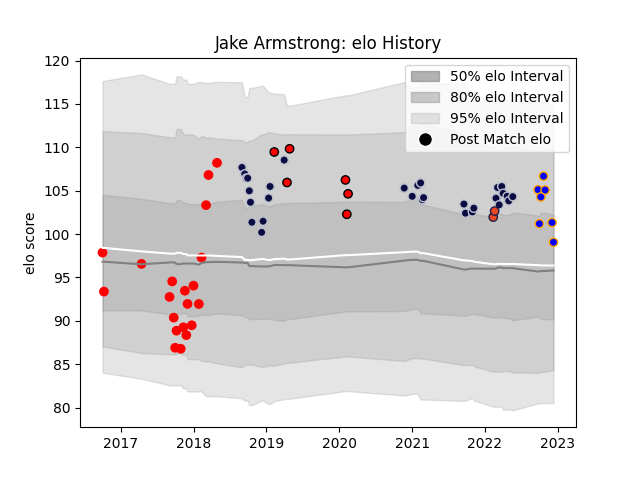

---  
layout: page  
title: Jake Armstrong  
date: 2022-12-14 11:26:32.727187  
categories: player  
---
# Jake Armstrong

## Positions: P

## Current elo: 99.0

## Current Percentile: 72.0

# Elo History

# Match History

| Team             |   Appearances |   Win Rate |
|:-----------------|--------------:|-----------:|
| Bristol Rugby    |            30 |   0.516667 |
| Jersey           |            20 |   0.575    |
| Doncaster        |             7 |   0.571429 |
| Hartpury College |             6 |   0        |
| Edinburgh        |             2 |   0        |

| Opponent            |   Matches |   Win Rate |
|:--------------------|----------:|-----------:|
| London Scottish     |         4 |   0.75     |
| Richmond            |         4 |   0.75     |
| Wasps               |         3 |   0.333333 |
| La Rochelle         |         3 |   0.333333 |
| Bedford             |         3 |   0.666667 |
| Nottingham          |         3 |   0.166667 |
| London Irish        |         3 |   0.5      |
| Gloucester Rugby    |         3 |   0.666667 |
| Bath Rugby          |         3 |   0.666667 |
| Northampton Saints  |         2 |   0        |
| Newcastle Falcons   |         2 |   0.5      |
| Saracens            |         2 |   0        |
| Leicester Tigers    |         2 |   0.5      |
| Zebre               |         2 |   0.5      |
| Worcester Warriors  |         2 |   0.5      |
| Harlequins          |         2 |   0.5      |
| Yorkshire Carnegie  |         2 |   0        |
| Ealing Trailfinders |         2 |   0        |
| Doncaster           |         2 |   0.5      |
| Coventry            |         2 |   0        |
| Cornish Pirates     |         2 |   1        |
| Bristol Rugby       |         2 |   0.5      |
| RC Enisei           |         2 |   1        |
| Rotherham Titans    |         1 |   1        |
| Ampthill            |         1 |   1        |
| Munster             |         1 |   0        |
| London Welsh        |         1 |   0        |
| Jersey              |         1 |   0        |
| Hartpury College    |         1 |   1        |
| Exeter Chiefs       |         1 |   1        |
| Leinster            |         1 |   0        |