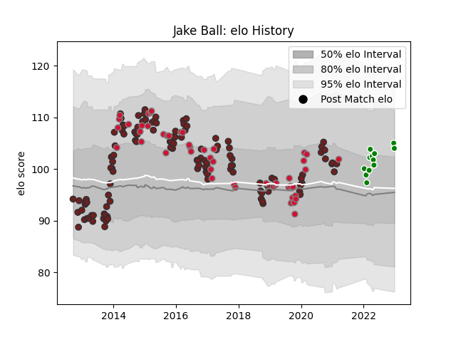

---  
layout: page  
title: Jake Ball  
date: 2023-03-21 18:09:43.781685  
categories: player  
---
# Jake Ball

Last updated: 2023-03-21
## Positions: L

## Country: Wales

## Current elo: 103.0

## Current Percentile: 68.0

# Elo History

# Match History

| Team                  |   Appearances |   Win Rate |
|:----------------------|--------------:|-----------:|
| Scarlets              |           124 |  0.512097  |
| Wales                 |            49 |  0.510204  |
| Green Rockets Tokatsu |            12 |  0.0833333 |

| Opponent                          |   Matches |   Win Rate |
|:----------------------------------|----------:|-----------:|
| Ospreys                           |        13 |   0.461538 |
| Cardiff Blues                     |        11 |   0.727273 |
| Dragons                           |        10 |   0.8      |
| Benetton Treviso                  |         9 |   0.888889 |
| Ulster                            |         8 |   0.3125   |
| Connacht                          |         8 |   0.875    |
| Munster                           |         8 |   0.375    |
| Ireland                           |         8 |   0.375    |
| Leinster                          |         7 |   0.142857 |
| Glasgow Warriors                  |         7 |   0        |
| England                           |         7 |   0.142857 |
| Italy                             |         7 |   1        |
| Toulon                            |         6 |   0.166667 |
| Edinburgh                         |         6 |   0.583333 |
| New Zealand                       |         5 |   0        |
| Zebre                             |         5 |   0.9      |
| France                            |         5 |   0.6      |
| Racing 92                         |         4 |   0.375    |
| Sale Sharks                       |         4 |   0.25     |
| Scotland                          |         4 |   0.75     |
| Australia                         |         4 |   0.25     |
| Saracens                          |         3 |   0.166667 |
| South Africa                      |         3 |   0.333333 |
| Kobelco Kobe Steelers             |         2 |   0        |
| Yokohama Canon Eagles             |         2 |   0        |
| Uruguay                           |         2 |   1        |
| Southern Kings                    |         2 |   1        |
| Leicester Tigers                  |         2 |   0.5      |
| Harlequins                        |         2 |   0.5      |
| Bath Rugby                        |         2 |   0.5      |
| Clermont Auvergne                 |         2 |   0        |
| Mie Honda Heat                    |         2 |   0.5      |
| Northampton Saints                |         1 |   0        |
| Toshiba Brave Lupus Tokyo         |         1 |   0        |
| Worcester Warriors                |         1 |   0        |
| London Irish                      |         1 |   1        |
| Urayasu D-Rocks                   |         1 |   0        |
| Bayonne                           |         1 |   1        |
| Black Rams Tokyo                  |         1 |   0        |
| Tonga                             |         1 |   1        |
| Cheetahs                          |         1 |   1        |
| Fiji                              |         1 |   1        |
| Japan                             |         1 |   1        |
| NTT Docomo Red Hurricanes Osaka   |         1 |   0        |
| Saitama Wild Knights              |         1 |   0        |
| Georgia                           |         1 |   1        |
| Kubota Spears Funabashi Tokyo-Bay |         1 |   0        |