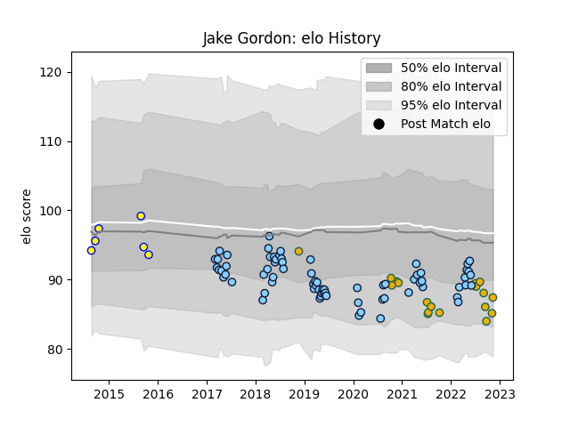

---  
layout: page  
title: Jake Gordon  
date: 2022-11-16 11:21:16.459669  
categories: player  
---
# Jake Gordon

## Positions: SH

## Country: Australia

## Current elo: 87.0

## Current Percentile: 11.0

# Elo History

# Match History

| Team                     |   Appearances |   Win Rate |
|:-------------------------|--------------:|-----------:|
| New South Wales Waratahs |            72 |   0.368056 |
| Australia                |            18 |   0.416667 |
| Sydney Stars             |             6 |   0.416667 |

| Opponent           |   Matches |   Win Rate |
|:-------------------|----------:|-----------:|
| Melbourne Rebels   |         9 |   0.666667 |
| Brumbies           |         8 |   0.125    |
| Queensland Reds    |         7 |   0.714286 |
| Blues              |         6 |   0        |
| Crusaders          |         6 |   0.333333 |
| Highlanders        |         6 |   0.5      |
| New Zealand        |         5 |   0.1      |
| Lions              |         5 |   0.2      |
| Argentina          |         4 |   0.75     |
| Sunwolves          |         4 |   0.75     |
| Chiefs             |         4 |   0        |
| France             |         4 |   0.5      |
| Hurricanes         |         4 |   0        |
| Jaguares           |         3 |   0        |
| Western Force      |         3 |   0.666667 |
| Italy              |         2 |   0.5      |
| England            |         2 |   0.5      |
| Canberra Vikings   |         2 |   0.25     |
| Sharks             |         2 |   0.25     |
| Brisbane City      |         2 |   0        |
| Fijian Drua        |         1 |   1        |
| Moana Pasifika     |         1 |   1        |
| North Harbour Rays |         1 |   1        |
| Queensland Country |         1 |   1        |
| Bulls              |         1 |   0        |
| South Africa       |         1 |   0        |
| Southern Kings     |         1 |   0        |
| Stormers           |         1 |   1        |