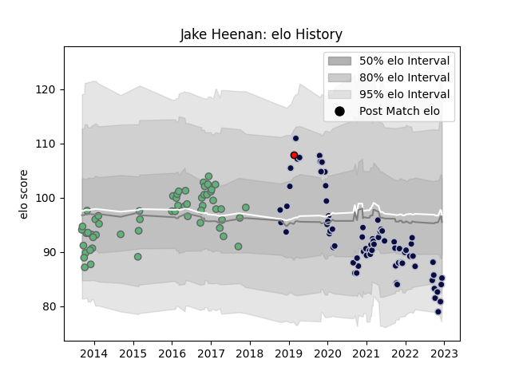

---  
layout: page  
title: Jake Heenan  
date: 2023-03-21 18:48:40.363726  
categories: player  
---
# Jake Heenan

Last updated: 2023-03-21
## Positions: FL

## Current elo: 97.0

## Current Percentile: 46.0

# Elo History

# Match History

| Team             |   Appearances |   Win Rate |
|:-----------------|--------------:|-----------:|
| Bristol Rugby    |            85 |   0.605882 |
| Connacht         |            58 |   0.465517 |
| Hartpury College |             1 |   1        |

| Opponent               |   Matches |   Win Rate |
|:-----------------------|----------:|-----------:|
| Zebre                  |        10 |   0.85     |
| Harlequins             |         8 |   0.5      |
| Wasps                  |         8 |   0.375    |
| Northampton Saints     |         8 |   0.5      |
| Scarlets               |         7 |   0.142857 |
| Saracens               |         7 |   0.142857 |
| Bath Rugby             |         7 |   0.857143 |
| Dragons                |         7 |   0.714286 |
| Sale Sharks            |         6 |   0.333333 |
| Leinster               |         6 |   0.333333 |
| London Irish           |         6 |   0.583333 |
| Newcastle Falcons      |         5 |   0.6      |
| Worcester Warriors     |         5 |   0.8      |
| Leicester Tigers       |         5 |   0.5      |
| Cardiff Blues          |         5 |   0.4      |
| Edinburgh              |         5 |   0.8      |
| Glasgow Warriors       |         5 |   0.4      |
| Gloucester Rugby       |         4 |   0.75     |
| Stade Toulousain       |         4 |   0.5      |
| Benetton Treviso       |         4 |   0.5      |
| Exeter Chiefs          |         3 |   0.333333 |
| Ospreys                |         3 |   0.333333 |
| RC Enisei              |         2 |   1        |
| Stade Francais Paris   |         2 |   1        |
| La Rochelle            |         2 |   0.5      |
| Ulster                 |         2 |   0.5      |
| Enisey-STM Krasnoyarsk |         2 |   1        |
| Perpignan              |         2 |   1        |
| Richmond               |         1 |   1        |
| Munster                |         1 |   0        |
| Toulon                 |         1 |   1        |
| Brive                  |         1 |   1        |