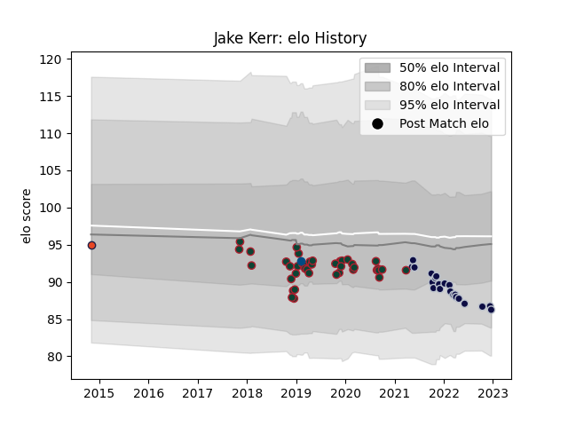

---  
layout: page  
title: Jake Kerr  
date: 2022-12-18 16:18:14.540515  
categories: player  
---
# Jake Kerr

## Positions: H

## Country: Scotland

## Current elo: 86.0

## Current Percentile: 15.0

# Elo History

# Match History

| Team             |   Appearances |   Win Rate |
|:-----------------|--------------:|-----------:|
| Leicester Tigers |            40 |   0.275    |
| Bristol Rugby    |            21 |   0.428571 |
| Edinburgh        |             1 |   0        |
| Scotland         |             1 |   1        |

| Opponent           |   Matches |   Win Rate |
|:-------------------|----------:|-----------:|
| Gloucester Rugby   |         7 |   0.571429 |
| Sale Sharks        |         6 |   0.166667 |
| Bath Rugby         |         5 |   0.4      |
| Saracens           |         5 |   0        |
| Harlequins         |         4 |   0.25     |
| Worcester Warriors |         4 |   0.5      |
| Northampton Saints |         4 |   0        |
| Exeter Chiefs      |         4 |   0        |
| Bristol Rugby      |         3 |   0        |
| Wasps              |         3 |   0.333333 |
| London Irish       |         2 |   0.5      |
| Newcastle Falcons  |         2 |   0.5      |
| Pau                |         2 |   0.5      |
| Racing 92          |         2 |   0        |
| Cardiff Blues      |         2 |   1        |
| Scarlets           |         2 |   0.5      |
| Italy              |         1 |   1        |
| Leinster           |         1 |   0        |
| Perpignan          |         1 |   1        |
| Ulster             |         1 |   0        |
| Calvisano          |         1 |   1        |
| Zebre              |         1 |   1        |