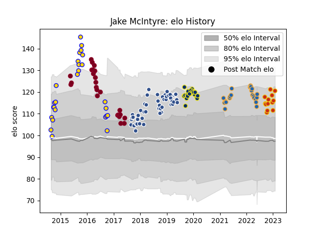

---  
layout: page  
title: Jake McIntyre  
date: 2022-12-18 16:35:51.424788  
categories: player  
---
# Jake McIntyre

## Positions: FH

## Current elo: 106.0

## Current Percentile: 73.0

# Elo History

# Match History

| Team              |   Appearances |   Win Rate |
|:------------------|--------------:|-----------:|
| Agen              |            48 |   0.364583 |
| Brisbane City     |            25 |   0.8      |
| Queensland Reds   |            25 |   0.26     |
| Western Force     |            22 |   0.227273 |
| Clermont Auvergne |            20 |   0.65     |
| Perpignan         |             9 |   0.333333 |

| Opponent                 |   Matches |   Win Rate |
|:-------------------------|----------:|-----------:|
| Stade Francais Paris     |         7 |   0.571429 |
| Brumbies                 |         6 |   0        |
| Bordeaux Begles          |         6 |   0.333333 |
| Lyon                     |         6 |   0.5      |
| Montpellier Herault      |         5 |   0.4      |
| Melbourne Rebels         |         5 |   0.4      |
| Clermont Auvergne        |         5 |   0.2      |
| Pau                      |         5 |   0.2      |
| La Rochelle              |         5 |   0.4      |
| Toulon                   |         5 |   0.6      |
| New South Wales Waratahs |         5 |   0.2      |
| Brive                    |         4 |   0.25     |
| Canberra Vikings         |         4 |   0.75     |
| Perth Spirit             |         4 |   0.75     |
| Stade Toulousain         |         4 |   0        |
| Crusaders                |         4 |   0        |
| Western Force            |         4 |   0.25     |
| Melbourne Rising         |         3 |   0.333333 |
| Hurricanes               |         3 |   0.333333 |
| NSW Country Eagles       |         3 |   1        |
| Queensland Country       |         3 |   1        |
| Racing 92                |         3 |   0.333333 |
| Highlanders              |         3 |   0.333333 |
| Harlequins               |         3 |   0.666667 |
| Grenoble                 |         3 |   0.5      |
| Castres Olympique        |         3 |   0.333333 |
| Sydney Stars             |         3 |   1        |
| Blues                    |         3 |   0.166667 |
| North Harbour Rays       |         3 |   0.666667 |
| Queensland Reds          |         2 |   0        |
| Sharks                   |         2 |   0.5      |
| Perpignan                |         2 |   1        |
| Ulster                   |         2 |   0.5      |
| Agen                     |         2 |   1        |
| Oyonnax                  |         2 |   0.5      |
| Greater Sydney Rams      |         2 |   1        |
| Chiefs                   |         2 |   0        |
| Bayonne                  |         2 |   0.5      |
| Moana Pasifika           |         1 |   1        |
| Bath Rugby               |         1 |   1        |
| Jaguares                 |         1 |   0        |
| Glasgow Warriors         |         1 |   0        |
| Fijian Drua              |         1 |   1        |
| Cheetahs                 |         1 |   1        |
| Stormers                 |         1 |   0        |
| Sunwolves                |         1 |   1        |
| Bulls                    |         1 |   0        |
| Benetton Treviso         |         1 |   1        |
| Lions                    |         1 |   0        |