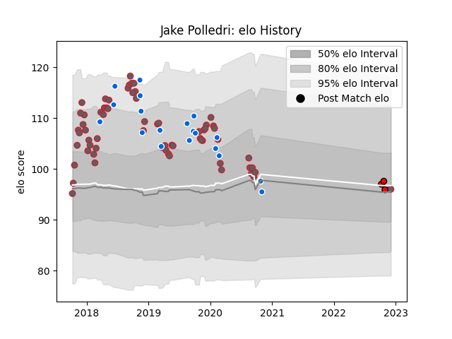

---  
layout: page  
title: Jake Polledri  
date: 2022-12-09 13:11:08.800316  
categories: player  
---
# Jake Polledri

## Positions: FL, N8

## Country: Italy

## Current elo: 96.0

## Current Percentile: 52.0

# Elo History

# Match History

| Team             |   Appearances |   Win Rate |
|:-----------------|--------------:|-----------:|
| Gloucester Rugby |            65 |   0.492308 |
| Italy            |            19 |   0.315789 |
| Hartpury College |             3 |   0.333333 |

| Opponent            |   Matches |   Win Rate |
|:--------------------|----------:|-----------:|
| Wasps               |         6 |   0.583333 |
| Saracens            |         6 |   0.333333 |
| Bath Rugby          |         5 |   0.5      |
| Harlequins          |         5 |   0.2      |
| Northampton Saints  |         5 |   0.8      |
| London Irish        |         4 |   1        |
| Leicester Tigers    |         4 |   0.5      |
| Worcester Warriors  |         4 |   0.5      |
| Bristol Rugby       |         4 |   0.25     |
| Newcastle Falcons   |         4 |   0.75     |
| Exeter Chiefs       |         3 |   0.333333 |
| France              |         3 |   0        |
| Stade Toulousain    |         2 |   0        |
| Scotland            |         2 |   0        |
| Sale Sharks         |         2 |   0        |
| Pau                 |         2 |   0        |
| Agen                |         2 |   1        |
| Zebre               |         2 |   1        |
| England             |         2 |   0        |
| Japan               |         2 |   0.5      |
| Georgia             |         2 |   1        |
| Bedford             |         1 |   0        |
| Canada              |         1 |   1        |
| Wales               |         1 |   0        |
| Cardiff Blues       |         1 |   0        |
| South Africa        |         1 |   0        |
| Castres Olympique   |         1 |   1        |
| Connacht            |         1 |   1        |
| Jersey              |         1 |   0        |
| Australia           |         1 |   0        |
| Nottingham          |         1 |   1        |
| Ireland             |         1 |   0        |
| New Zealand         |         1 |   0        |
| Namibia             |         1 |   1        |
| Munster             |         1 |   0        |
| Montpellier Herault |         1 |   0        |
| Russia              |         1 |   1        |