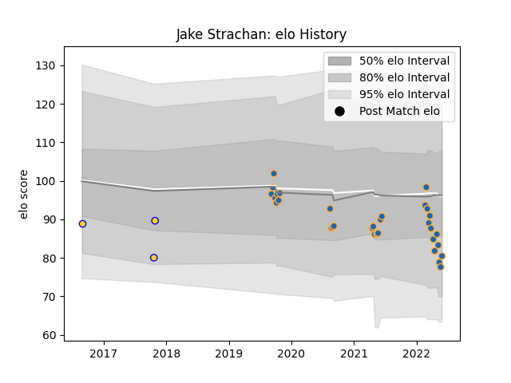

---  
layout: page  
title: Jake Strachan  
date: 2023-03-06 11:26:08.581112  
categories: player  
---
# Jake Strachan

## Positions: FB

## Current elo: 80.0

## Current Percentile: 15.0

# Elo History

# Match History

| Team          |   Appearances |   Win Rate |
|:--------------|--------------:|-----------:|
| Western Force |            32 |   0.375    |
| Brisbane City |             3 |   0.166667 |

| Opponent                 |   Matches |   Win Rate |
|:-------------------------|----------:|-----------:|
| Brumbies                 |         4 |   0        |
| New South Wales Waratahs |         4 |   0.25     |
| Melbourne Rebels         |         3 |   0.333333 |
| NSW Country Eagles       |         3 |   0.166667 |
| Queensland Reds          |         3 |   0.333333 |
| Blues                    |         2 |   0        |
| Brisbane City            |         2 |   1        |
| Canberra Vikings         |         2 |   1        |
| Chiefs                   |         2 |   0        |
| Crusaders                |         2 |   0        |
| Fijian Drua              |         2 |   1        |
| Highlanders              |         2 |   0        |
| Greater Sydney Rams      |         1 |   0        |
| Hurricanes               |         1 |   1        |
| Melbourne Rising         |         1 |   1        |
| Sydney Rays              |         1 |   1        |