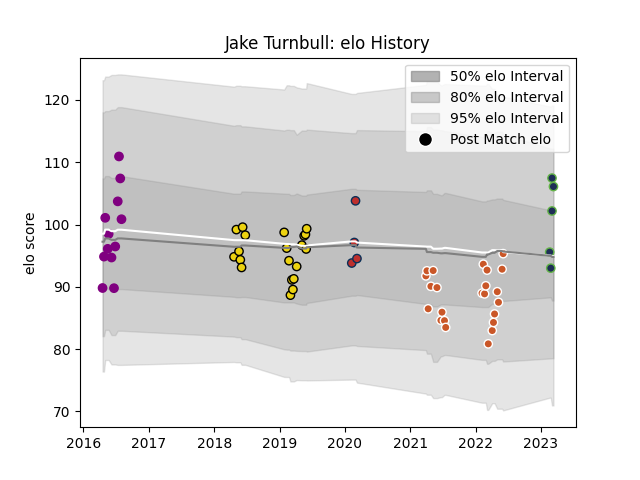

---  
layout: page  
title: Jake Turnbull  
date: 2023-03-21 18:31:56.191713  
categories: player  
---
# Jake Turnbull

Last updated: 2023-03-21
## Positions: P

## Current elo: 106.0

## Current Percentile: 84.0

# Elo History

# Match History

| Team              |   Appearances |   Win Rate |
|:------------------|--------------:|-----------:|
| Austin Gilgronis  |            23 |   0.695652 |
| Houston SaberCats |            20 |   0.3      |
| Denver            |            12 |   0.833333 |
| Seattle Seawolves |             5 |   1        |
| Old Glory DC      |             4 |   0.75     |

| Opponent               |   Matches |   Win Rate |
|:-----------------------|----------:|-----------:|
| Utah Warriors          |         6 |   0.5      |
| NOLA Gold              |         6 |   0.333333 |
| Seattle Seawolves      |         6 |   0.666667 |
| San Diego Legion       |         6 |   0.5      |
| Houston SaberCats      |         5 |   1        |
| Dallas Jackals         |         4 |   1        |
| Sacramento             |         3 |   1        |
| Glendale Raptors       |         3 |   0.333333 |
| L. A. Giltinis         |         3 |   0.333333 |
| Ohio                   |         3 |   0.333333 |
| San Francisco          |         3 |   1        |
| Rugby ATL              |         3 |   0.666667 |
| San Diego              |         3 |   1        |
| Austin Elite Rugby     |         2 |   1        |
| Old Glory DC           |         2 |   0.5      |
| R.U. New York          |         2 |   0        |
| Rugby New York         |         1 |   1        |
| Austin Herd            |         1 |   1        |
| New England Free Jacks |         1 |   0        |
| Toronto Arrows         |         1 |   0        |