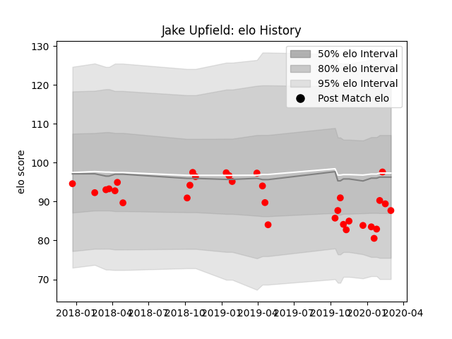

---  
layout: page  
title: Jake Upfield  
date: 2023-03-02 11:22:33.168908  
categories: player  
---
# Jake Upfield

## Positions: FL

## Current elo: 88.0

## Current Percentile: 31.0

# Elo History

# Match History

| Team   |   Appearances |   Win Rate |
|:-------|--------------:|-----------:|
| Jersey |            32 |     0.5625 |

| Opponent            |   Matches |   Win Rate |
|:--------------------|----------:|-----------:|
| Doncaster           |         4 |       0.75 |
| Ealing Trailfinders |         4 |       0    |
| Nottingham          |         4 |       0.75 |
| Hartpury College    |         3 |       1    |
| Bedford             |         2 |       0.5  |
| Cornish Pirates     |         2 |       0.5  |
| Coventry            |         2 |       0.5  |
| London Scottish     |         2 |       0.5  |
| Newcastle Falcons   |         2 |       0    |
| Richmond            |         2 |       1    |
| Yorkshire Carnegie  |         2 |       0.5  |
| Ampthill            |         1 |       1    |
| London Irish        |         1 |       0    |
| Rotherham Titans    |         1 |       1    |